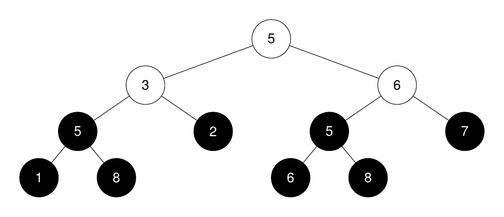
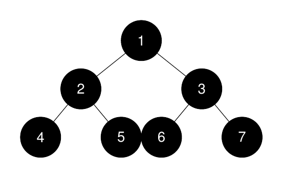
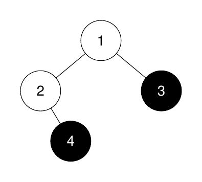

### 1. Description

You are given the `root` of a **binary tree** and an integer `k`.

Return an integer denoting the size of the $$k^{\text{th}}$$ **largest* *perfect binary*** *subtree, or `-1` if it doesn't exist.

A **perfect binary tree** is a tree where all leaves are on the same level, and every parent has two children.

### 2. Function Contract

- `n`: Input parameter.
- Returns expected result.

### 3. Examples

#### Example 1

**Input:** root = [5,3,6,5,2,5,7,1,8,null,null,6,8], k = 2

**Output:** 3

**Explanation:**

The roots of the perfect binary subtrees are highlighted in black. Their sizes, in non-increasing order are `[3, 3, 1, 1, 1, 1, 1, 1]`.

The $2^nd$ largest size is 3.

#### Example 2

**Input:** root = [1,2,3,4,5,6,7], k = 1

**Output:** 7

**Explanation:**

The sizes of the perfect binary subtrees in non-increasing order are `[7, 3, 3, 1, 1, 1, 1]`. The size of the largest perfect binary subtree is 7.

#### Example 3

**Input:** root = [1,2,3,null,4], k = 3

**Output:** -1

**Explanation:**

The sizes of the perfect binary subtrees in non-increasing order are `[1, 1]`. There are fewer than 3 perfect binary subtrees.

### 4. Constraints

- The number of nodes in the tree is in the range `[1, 2000]`.

- $1 \le \text{Node.val} \le 2000$

- $1 \le k \le 1024$