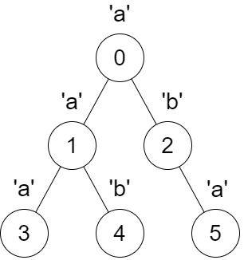
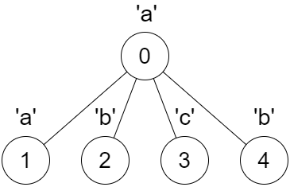

## Description

You are given a tree rooted at node 0, consisting of `n` nodes numbered from `0` to $n - 1$. The tree is represented by an array `parent` of size `n`, where $\text{parent}[i]$ is the parent of node `i`. Since node 0 is the root, $\text{parent}[0] = -1$.

You are also given a string `s` of length `n`, where $s[i]$ is the character assigned to node `i`.

Consider an empty string `dfsStr`, and define a recursive function `dfs(int x)` that takes a node `x` as a parameter and performs the following steps in order:

- Iterate over each child `y` of `x` **in increasing order of their numbers**, and call `dfs(y)`.

- Add the character $s[x]$ to the end of the string `dfsStr`.

**Note** that `dfsStr` is shared across all recursive calls of `dfs`.

You need to find a boolean array `answer` of size `n`, where for each index `i` from `0` to $n - 1$, you do the following:

- Empty the string `dfsStr` and call `dfs(i)`.

- If the resulting string `dfsStr` is a palindrome, then set $\text{answer}[i]$ to `true`. Otherwise, set $\text{answer}[i]$ to `false`.

Return the array `answer`.
### Function Contract

- `n`: Input parameter.
- Returns expected result.

### Examples

#### Example 1

**Input:** parent = [-1,0,0,1,1,2], s = "aababa"

**Output:** [true,true,false,true,true,true]

**Explanation:**

- Calling `dfs(0)` results in the string $dfsStr = "abaaba"$, which is a palindrome.

- Calling `dfs(1)` results in the string $dfsStr = "aba"$, which is a palindrome.

- Calling `dfs(2)` results in the string $dfsStr = "ab"$, which is **not** a palindrome.

- Calling `dfs(3)` results in the string $dfsStr = "a"$, which is a palindrome.

- Calling `dfs(4)` results in the string $dfsStr = "b"$, which is a palindrome.

- Calling `dfs(5)` results in the string $dfsStr = "a"$, which is a palindrome.

#### Example 2

**Input:** parent = [-1,0,0,0,0], s = "aabcb"

**Output:** [true,true,true,true,true]

**Explanation:**

Every call on `dfs(x)` results in a palindrome string.

### Constraints

- $n = \text{parent.length} = \text{s.length}$

- $1 \le n \le 10^{5}$

- $0 \le \text{parent}[i] \le n - 1$ for all $i \ge 1$.

- $\text{parent}[0] = -1$

- `parent` represents a valid tree.

- `s` consists only of lowercase English letters.