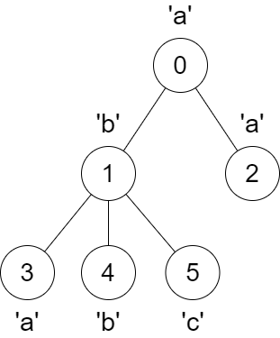
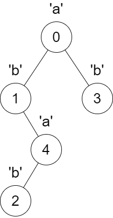

### 1. Description

You are given a tree rooted at node 0 that consists of `n` nodes numbered from `0` to $n - 1$. The tree is represented by an array `parent` of size `n`, where $\text{parent}[i]$ is the parent of node `i`. Since node 0 is the root, $\text{parent}[0] = -1$.

You are also given a string `s` of length `n`, where $s[i]$ is the character assigned to node `i`.

We make the following changes on the tree **one** time **simultaneously** for all nodes `x` from `1` to $n - 1$:

- Find the **closest** node `y` to node `x` such that `y` is an ancestor of `x`, and $s[x] = s[y]$.

- If node `y` does not exist, do nothing.

- Otherwise, **remove** the edge between `x` and its current parent and make node `y` the new parent of `x` by adding an edge between them.

Return an array `answer` of size `n` where $\text{answer}[i]$ is the **size** of the subtree rooted at node `i` in the **final** tree.

### 2. Function Contract

- `n`: Input parameter.
- Returns expected result.

### 3. Examples

#### Example 1

**Input:** parent = [-1,0,0,1,1,1], s = "abaabc"

**Output:** [6,3,1,1,1,1]

**Explanation:**

The parent of node 3 will change from node 1 to node 0.

#### Example 2

**Input:** parent = [-1,0,4,0,1], s = "abbba"

**Output:** [5,2,1,1,1]

**Explanation:**

The following changes will happen at the same time:

- The parent of node 4 will change from node 1 to node 0.

- The parent of node 2 will change from node 4 to node 1.

### 4. Constraints

- $n = \text{parent.length} = \text{s.length}$

- $1 \le n \le 10^{5}$

- $0 \le \text{parent}[i] \le n - 1$ for all $i \ge 1$.

- $\text{parent}[0] = -1$

- `parent` represents a valid tree.

- `s` consists only of lowercase English letters.