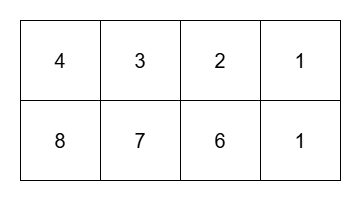

## Description

You are given a 2D matrix `grid` of size `m x n`. You are also given a **non-negative** integer `k`.

Return the number of **submatrices** of `grid` that satisfy the following conditions:

- The maximum element in the submatrix **less than or equal to** `k`.

- Each row in the submatrix is sorted in **non-increasing** order.

A submatrix `(x1, y1, x2, y2)` is a matrix that forms by choosing all cells $\text{grid}[x][y]$ where $x1 \le x \le x2$ and $y1 \le y \le y2$.
### Function Contract

- Refer to method signature.

### Examples
#### Example 1

**Input:** grid = [[4,3,2,1],[8,7,6,1]], k = 3

**Output:** 8

**Explanation:**

**

**

The 8 submatrices are:

- `[[1]]`

- `[[1]]`

- `[[2,1]]`

- `[[3,2,1]]`

- `[[1],[1]]`

- `[[2]]`

- `[[3]]`

- `[[3,2]]`

#### Example 2

**Input:** grid = [[1,1,1],[1,1,1],[1,1,1]], k = 1

**Output:** 36

**Explanation:**

There are 36 submatrices of grid. All submatrices have their maximum element equal to 1.

#### Example 3

**Input:** grid = [[1]], k = 1

**Output:** 1

### Constraints

- $1 \le m = \text{grid.length} \le 10^{3}$

- $1 \le n = \text{grid}[i].length \le 10^{3}$

- $1 \le \text{grid}[i][j] \le 10^{9}$

- $1 \le k \le 10^{9}$

​​​​​​