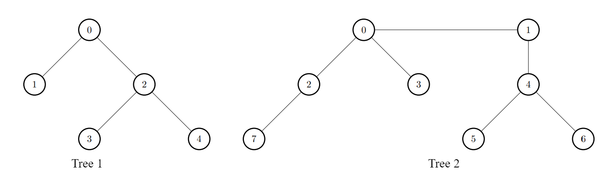
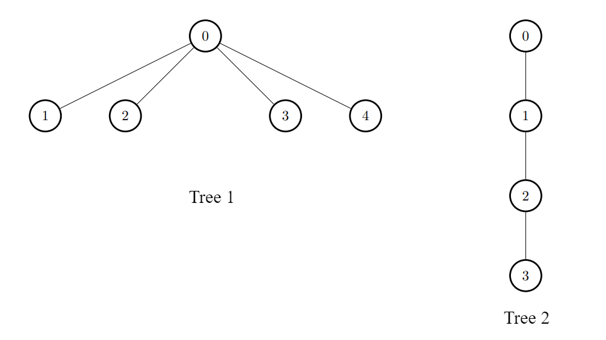

## Description

There exist two **undirected **trees with `n` and `m` nodes, labeled from `[0, n - 1]` and `[0, m - 1]`, respectively.

You are given two 2D integer arrays `edges1` and `edges2` of lengths $n - 1$ and $m - 1$, respectively, where $\text{edges1}[i] = [a_{i}, b_{i}]$ indicates that there is an edge between nodes $a_{i}$ and $b_{i}$ in the first tree and $\text{edges2}[i] = [u_{i}, v_{i}]$ indicates that there is an edge between nodes $u_{i}$ and $v_{i}$ in the second tree.

Node `u` is **target** to node `v` if the number of edges on the path from `u` to `v` is even. **Note** that a node is *always* **target** to itself.

Return an array of `n` integers `answer`, where $\text{answer}[i]$ is the **maximum** possible number of nodes that are **target** to node `i` of the first tree if you had to connect one node from the first tree to another node in the second tree.

**Note** that queries are independent from each other. That is, for every query you will remove the added edge before proceeding to the next query.
### Function Contract

- `n`: Input parameter.
- Returns expected result.

### Examples
#### Example 1

**Input:** edges1 = [[0,1],[0,2],[2,3],[2,4]], edges2 = [[0,1],[0,2],[0,3],[2,7],[1,4],[4,5],[4,6]]

**Output:** [8,7,7,8,8]

**Explanation:**

- For $i = 0$, connect node 0 from the first tree to node 0 from the second tree.

- For $i = 1$, connect node 1 from the first tree to node 4 from the second tree.

- For $i = 2$, connect node 2 from the first tree to node 7 from the second tree.

- For $i = 3$, connect node 3 from the first tree to node 0 from the second tree.

- For $i = 4$, connect node 4 from the first tree to node 4 from the second tree.

#### Example 2

**Input:** edges1 = [[0,1],[0,2],[0,3],[0,4]], edges2 = [[0,1],[1,2],[2,3]]

**Output:** [3,6,6,6,6]

**Explanation:**

For every `i`, connect node `i` of the first tree with any node of the second tree.

### Constraints

- $2 \le n, m \le 10^{5}$

- $\text{edges1.length} = n - 1$

- $\text{edges2.length} = m - 1$

- $\text{edges1}[i].length = \text{edges2}[i].length = 2$

- $\text{edges1}[i] = [a_{i}, b_{i}]$

- $0 \le a_{i}, b_{i} < n$

- $\text{edges2}[i] = [u_{i}, v_{i}]$

- $0 \le u_{i}, v_{i} < m$

- The input is generated such that `edges1` and `edges2` represent valid trees.