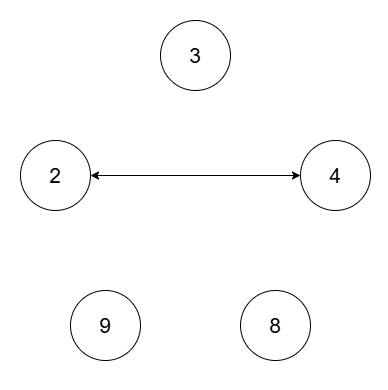
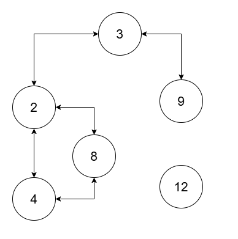

## Description

You are given an array of integers `nums` of size `n` and a **positive** integer `threshold`.

There is a graph consisting of `n` nodes with the $$i^{\text{th}}$$ node having a value of $\text{nums}[i]$. Two nodes `i` and `j` in the graph are connected via an **undirected** edge if $lcm(\text{nums}[i], \text{nums}[j]) \le threshold$.

Return the number of **connected components** in this graph.

A **connected component** is a subgraph of a graph in which there exists a path between any two vertices, and no vertex of the subgraph shares an edge with a vertex outside of the subgraph.

The term `lcm(a, b)` denotes the **least common multiple** of `a` and `b`.
### Function Contract

- `n`: Input parameter.
- Returns expected result.

### Examples

#### Example 1

**Input:** nums = [2,4,8,3,9], threshold = 5

**Output:** 4

**Explanation:**

The four connected components are `(2, 4)`, `(3)`, `(8)`, `(9)`.

#### Example 2

**Input:** nums = [2,4,8,3,9,12], threshold = 10

**Output:** 2

**Explanation:**

The two connected components are `(2, 3, 4, 8, 9)`, and `(12)`.

### Constraints

- $1 \le \text{nums.length} \le 10^{5}$

- $1 \le \text{nums}[i] \le 10^{9}$

- All elements of `nums` are unique.

- $1 \le threshold \le 2 * 10^{5}$