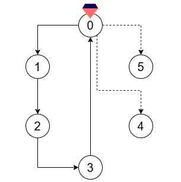
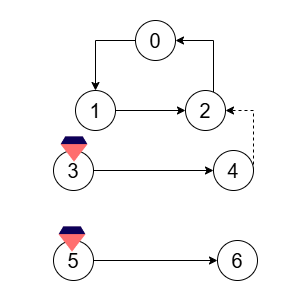

## Description

Alice has just graduated from wizard school, and wishes to cast a magic spell to celebrate. The magic spell contains certain **focus points** where magic needs to be concentrated, and some of these focus points contain **magic crystals** which serve as the spell's energy source. Focus points can be linked through **directed runes**, which channel magic flow from one focus point to another.

You are given a integer `n` denoting the *number* of focus points and an array of integers `crystals` where $\text{crystals}[i]$ indicates a focus point which holds a magic crystal. You are also given two integer arrays `flowFrom` and `flowTo`, which represent the existing **directed runes**. The $$i^{\text{th}}$$ rune allows magic to freely flow from focus point $\text{flowFrom}[i]$ to focus point $\text{flowTo}[i]$.

You need to find the number of directed runes Alice must add to her spell, such that *each* focus point either:

- **Contains** a magic crystal.

- **Receives** magic flow *from* another focus point.

Return the **minimum** number of directed runes that she should add.
### Function Contract

- Refer to method signature.

### Examples

#### Example 1

**Input:** n = 6, crystals = [0], flowFrom = [0,1,2,3], flowTo = [1,2,3,0]

**Output:** 2

**Explanation:**

Add two directed runes:

- From focus point 0 to focus point 4.

- From focus point 0 to focus point 5.

#### Example 2

**Input:** n = 7, crystals = [3,5], flowFrom = [0,1,2,3,5], flowTo = [1,2,0,4,6]

**Output:** 1

**Explanation:**

Add a directed rune from focus point 4 to focus point 2.

### Constraints

- $2 \le n \le 10^{5}$

- $1 \le \text{crystals.length} \le n$

- $0 \le \text{crystals}[i] \le n - 1$

- $1 \le \text{flowFrom.length} = \text{flowTo.length} \le min(2 * 10^{5}, (n * (n - 1)) / 2)$

- $0 \le \text{flowFrom}[i], \text{flowTo}[i] \le n - 1$

- $\text{flowFrom}[i] \neq \text{flowTo}[i]$

- All pre-existing directed runes are **distinct**.