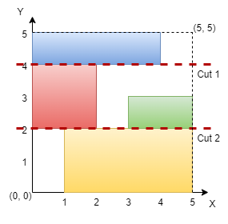
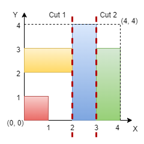

## Description

You are given an integer `n` representing the dimensions of an `n x n`<!-- notionvc: fa9fe4ed-dff8-4410-8196-346f2d430795 --> grid, with the origin at the bottom-left corner of the grid. You are also given a 2D array of coordinates `rectangles`, where $\text{rectangles}[i]$ is in the form `[start_x, start_y, end_x, end_y]`, representing a rectangle on the grid. Each rectangle is defined as follows:

- $(\text{start}_{x}, \text{start}_{y})$: The bottom-left corner of the rectangle.

- $(\text{end}_{x}, \text{end}_{y})$: The top-right corner of the rectangle.

**Note **that the rectangles do not overlap. Your task is to determine if it is possible to make **either two horizontal or two vertical cuts** on the grid such that:

- Each of the three resulting sections formed by the cuts contains **at least** one rectangle.

- Every rectangle belongs to **exactly** one section.

Return `true` if such cuts can be made; otherwise, return `false`.
### Function Contract

- `n`: Input parameter.
- Returns expected result.

### Examples
#### Example 1

**Input:** n = 5, rectangles = [[1,0,5,2],[0,2,2,4],[3,2,5,3],[0,4,4,5]]

**Output:** true

**Explanation:**

The grid is shown in the diagram. We can make horizontal cuts at $y = 2$ and $y = 4$. Hence, output is true.

#### Example 2

**Input:** n = 4, rectangles = [[0,0,1,1],[2,0,3,4],[0,2,2,3],[3,0,4,3]]

**Output:** true

**Explanation:**

We can make vertical cuts at $x = 2$ and $x = 3$. Hence, output is true.

#### Example 3

**Input:** n = 4, rectangles = [[0,2,2,4],[1,0,3,2],[2,2,3,4],[3,0,4,2],[3,2,4,4]]

**Output:** false

**Explanation:**

We cannot make two horizontal or two vertical cuts that satisfy the conditions. Hence, output is false.

### Constraints

- $3 \le n \le 10^{9}$

- $3 \le \text{rectangles.length} \le 10^{5}$

- $0 \le \text{rectangles}[i][0] < \text{rectangles}[i][2] \le n$

- $0 \le \text{rectangles}[i][1] < \text{rectangles}[i][3] \le n$

- No two rectangles overlap.