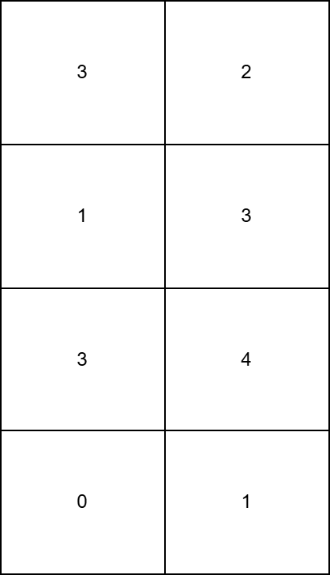
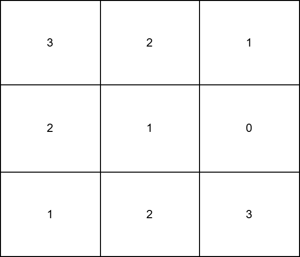

### 1. Description

You are given a `m x n` matrix `grid` consisting of **non-negative** integers.

In one operation, you can increment the value of any $\text{grid}[i][j]$ by 1.

Return the **minimum** number of operations needed to make all columns of `grid` **strictly increasing**.

### 2. Function Contract

**Inputs**

- `grid`: Input parameter (`List[List[int]]`).

**Return value**

- Returns `int`.

### 3. Examples

#### Example 1

- **Input:** grid = [[3,2],[1,3],[3,4],[0,1]]

- **Output:** 15

- **Explanation:** 

- To make the $0^th$ column strictly increasing, we can apply 3 operations on $\text{grid}[1][0]$, 2 operations on $\text{grid}[2][0]$, and 6 operations on $\text{grid}[3][0]$.

- To make the $1^st$ column strictly increasing, we can apply 4 operations on $\text{grid}[3][1]$.



#### Example 2

- **Input:** grid = [[3,2,1],[2,1,0],[1,2,3]]

- **Output:** 12

- **Explanation:** 

- To make the $0^th$ column strictly increasing, we can apply 2 operations on $\text{grid}[1][0]$, and 4 operations on $\text{grid}[2][0]$.

- To make the $1^st$ column strictly increasing, we can apply 2 operations on $\text{grid}[1][1]$, and 2 operations on $\text{grid}[2][1]$.

- To make the $2^nd$ column strictly increasing, we can apply 2 operations on $\text{grid}[1][2]$.



### 4. Constraints

- $m = \text{grid.length}$

- $n = \text{grid}[i].length$

- $1 \le m, n \le 50$

- $0 \le \text{grid}[i][j] < 2500$

```

```
