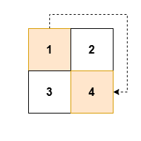
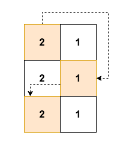
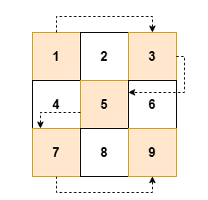

## Description

You are given an `m x n` 2D array `grid` of **positive** integers.

Your task is to traverse `grid` in a **zigzag** pattern while skipping every **alternate** cell.

Zigzag pattern traversal is defined as following the below actions:

- Start at the top-left cell `(0, 0)`.

- Move *right* within a row until the end of the row is reached.

- Drop down to the next row, then traverse *left* until the beginning of the row is reached.

- Continue **alternating** between right and left traversal until every row has been traversed.

**Note **that you **must skip** every *alternate* cell during the traversal.

Return an array of integers `result` containing, **in order**, the value of the cells visited during the zigzag traversal with skips.
### Function Contract

- `n`: Input parameter.
- Returns expected result.

### Examples

#### Example 1

**Input:** grid = [[1,2],[3,4]]

**Output:** [1,4]

**Explanation:**

**

**

#### Example 2

**Input:** grid = [[2,1],[2,1],[2,1]]

**Output:** [2,1,2]

**Explanation:**

#### Example 3

**Input:** grid = [[1,2,3],[4,5,6],[7,8,9]]

**Output:** [1,3,5,7,9]

**Explanation:**

### Constraints

- $2 \le n = \text{grid.length} \le 50$

- $2 \le m = \text{grid}[i].length \le 50$

- $1 \le \text{grid}[i][j] \le 2500$