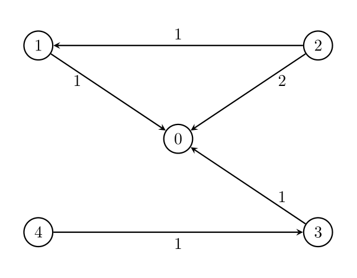
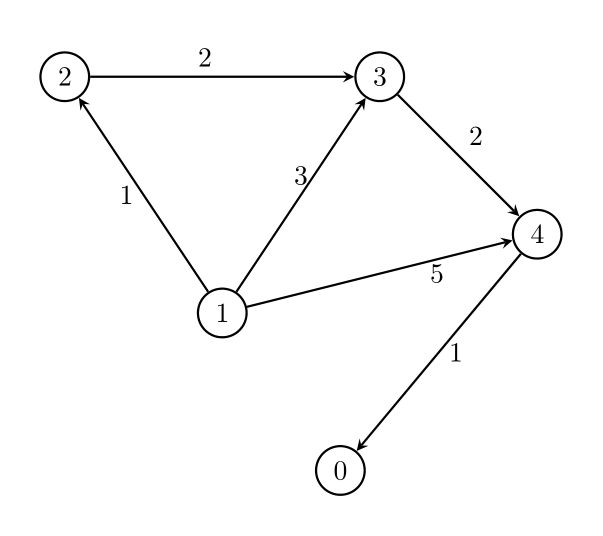

## Description

You are given two integers, `n` and `threshold`, as well as a **directed** weighted graph of `n` nodes numbered from 0 to $n - 1$. The graph is represented by a **2D** integer array `edges`, where $\text{edges}[i] = [A_{i}, B_{i}, W_{i}]$ indicates that there is an edge going from node $A_{i}$ to node $B_{i}$ with weight $W_{i}$.

You have to remove some edges from this graph (possibly **none**), so that it satisfies the following conditions:

- Node 0 must be reachable from all other nodes.

- The **maximum** edge weight in the resulting graph is **minimized**.

- Each node has **at most** `threshold` outgoing edges.

Return the **minimum** possible value of the **maximum** edge weight after removing the necessary edges. If it is impossible for all conditions to be satisfied, return -1.
### Function Contract

- `n`: Input parameter.
- Returns expected result.

### Examples

#### Example 1

**Input:** n = 5, edges = [[1,0,1],[2,0,2],[3,0,1],[4,3,1],[2,1,1]], threshold = 2

**Output:** 1

**Explanation:**

Remove the edge `2 -> 0`. The maximum weight among the remaining edges is 1.

#### Example 2

**Input:** n = 5, edges = [[0,1,1],[0,2,2],[0,3,1],[0,4,1],[1,2,1],[1,4,1]], threshold = 1

**Output:** -1

**Explanation:**

It is impossible to reach node 0 from node 2.

#### Example 3

**Input:** n = 5, edges = [[1,2,1],[1,3,3],[1,4,5],[2,3,2],[3,4,2],[4,0,1]], threshold = 1

**Output:** 2

**Explanation:**

Remove the edges `1 -> 3` and `1 -> 4`. The maximum weight among the remaining edges is 2.

#### Example 4

**Input:** n = 5, edges = [[1,2,1],[1,3,3],[1,4,5],[2,3,2],[4,0,1]], threshold = 1

**Output:** -1

### Constraints

- $2 \le n \le 10^{5}$

- $1 \le threshold \le n - 1$

- $1 \le \text{edges.length} \le min(10^{5}, n * (n - 1) / 2).$

- $\text{edges}[i].length = 3$

- $0 \le A_{i}, B_{i} < n$

- $A_{i} \neq B_{i}$

- $1 \le W_{i} \le 10^{6}$

- There **may be** multiple edges between a pair of nodes, but they must have unique weights.