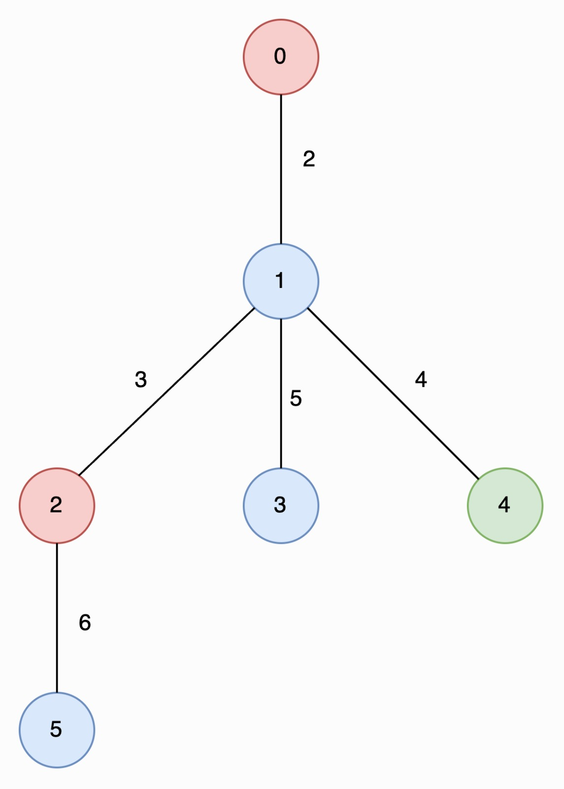
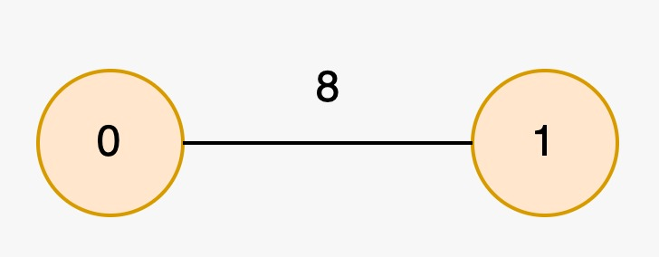

### 1. Description

You are given an undirected tree rooted at node `0` with `n` nodes numbered from `0` to $n - 1$, represented by a 2D array `edges` of length $n - 1$, where $\text{edges}[i] = [u_{i}, v_{i}, \text{length}_{i}]$ indicates an edge between nodes $u_{i}$ and $v_{i}$ with length $\text{length}_{i}$. You are also given an integer array `nums`, where $\text{nums}[i]$ represents the value at node `i`.

A **special path** is defined as a **downward** path from an ancestor node to a descendant node such that all the values of the nodes in that path are **unique**.

### 2. Function Contract

- `n`: Input parameter.
- Returns expected result.

### 3. Note

that a path may start and end at the same node.

Return an array `result` of size 2, where $\text{result}[0]$ is the **length** of the **longest** special path, and $\text{result}[1]$ is the **minimum** number of nodes in all *possible* **longest** special paths.

### 4. Examples

#### Example 1

**Input:** edges = [[0,1,2],[1,2,3],[1,3,5],[1,4,4],[2,5,6]], nums = [2,1,2,1,3,1]

**Output:** [6,2]

**Explanation:**

#### In the image below, nodes are colored by their corresponding values in `nums`

The longest special paths are `2 -> 5` and `0 -> 1 -> 4`, both having a length of 6. The minimum number of nodes across all longest special paths is 2.

#### Example 2

**Input:** edges = [[1,0,8]], nums = [2,2]

**Output:** [0,1]

**Explanation:**

The longest special paths are `0` and `1`, both having a length of 0. The minimum number of nodes across all longest special paths is 1.

### 5. Constraints

- $2 \le n \le 5 * 10^{4}$

- $\text{edges.length} = n - 1$

- $\text{edges}[i].length = 3$

- $0 \le u_{i}, v_{i} < n$

- $1 \le \text{length}_{i} \le 10^{3}$

- $\text{nums.length} = n$

- $0 \le \text{nums}[i] \le 5 * 10^{4}$

- The input is generated such that `edges` represents a valid tree.