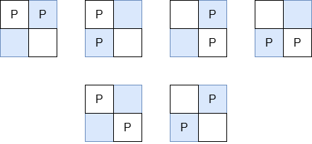

## Description

You are given three integers `m`, `n`, and `k`.

There is a rectangular grid of size `m × n` containing `k` identical pieces. Return the sum of Manhattan distances between every pair of pieces over all **valid arrangements** of pieces.

A **valid arrangement** is a placement of all `k` pieces on the grid with **at most** one piece per cell.

Since the answer may be very large, return it **modulo** $10^{9} + 7$.

The Manhattan Distance between two cells $(x_{i}, y_{i})$ and $(x_{j}, y_{j})$ is $|x_{i} - x_{j}| + |y_{i} - y_{j}|$.
### Function Contract

- `n`: Input parameter.
- Returns expected result.

### Examples
#### Example 1

**Input:** m = 2, n = 2, k = 2

**Output:** 8

**Explanation:**

The valid arrangements of pieces on the board are:

- In the first 4 arrangements, the Manhattan distance between the two pieces is 1.

- In the last 2 arrangements, the Manhattan distance between the two pieces is 2.

Thus, the total Manhattan distance across all valid arrangements is $1 + 1 + 1 + 1 + 2 + 2 = 8$.

#### Example 2

**Input:** m = 1, n = 4, k = 3

**Output:** 20

**Explanation:**

The valid arrangements of pieces on the board are:

- The first and last arrangements have a total Manhattan distance of $1 + 1 + 2 = 4$.

- The middle two arrangements have a total Manhattan distance of $1 + 2 + 3 = 6$.

The total Manhattan distance between all pairs of pieces across all arrangements is $4 + 6 + 6 + 4 = 20$.

### Constraints

- $1 \le m, n \le 10^{5}$

- $2 \le m * n \le 10^{5}$

- $2 \le k \le m * n$