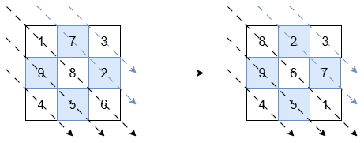
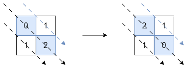

### 1. Description

You are given an `n x n` square matrix of integers `grid`. Return the matrix such that:

- The diagonals in the **bottom-left triangle** (including the middle diagonal) are sorted in **non-increasing order**.

- The diagonals in the **top-right triangle** are sorted in **non-decreasing order**.

### 2. Function Contract

- `n`: Input parameter.
- Returns expected result.

### 3. Examples

#### Example 1

**Input:** grid = [[1,7,3],[9,8,2],[4,5,6]]

**Output:** [[8,2,3],[9,6,7],[4,5,1]]

**Explanation:**

The diagonals with a black arrow (bottom-left triangle) should be sorted in non-increasing order:

- `[1, 8, 6]` becomes `[8, 6, 1]`.

- `[9, 5]` and `[4]` remain unchanged.

The diagonals with a blue arrow (top-right triangle) should be sorted in non-decreasing order:

- `[7, 2]` becomes `[2, 7]`.

- `[3]` remains unchanged.

#### Example 2

**Input:** grid = [[0,1],[1,2]]

**Output:** [[2,1],[1,0]]

**Explanation:**

The diagonals with a black arrow must be non-increasing, so `[0, 2]` is changed to `[2, 0]`. The other diagonals are already in the correct order.

#### Example 3

**Input:** grid = [[1]]

**Output:** [[1]]

**Explanation:**

Diagonals with exactly one element are already in order, so no changes are needed.

### 4. Constraints

- $\text{grid.length} = \text{grid}[i].length = n$

- $1 \le n \le 10$

- $-10^{5} \le \text{grid}[i][j] \le 10^{5}$