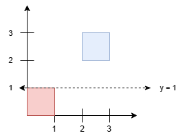
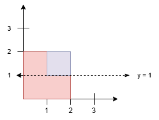

### 1. Description

You are given a 2D integer array `squares`. Each $\text{squares}[i] = [x_{i}, y_{i}, l_{i}]$ represents the coordinates of the bottom-left point and the side length of a square parallel to the x-axis.

Find the **minimum** y-coordinate value of a horizontal line such that the total area covered by squares above the line *equals* the total area covered by squares below the line.

Answers within $10^{-5}$ of the actual answer will be accepted.

### 2. Function Contract

- `n`: Input parameter.
- Returns expected result.

### 3. Note

: Squares **may** overlap. Overlapping areas should be counted **only once** in this version.

### 4. Examples

#### Example 1

**Input:** squares = [[0,0,1],[2,2,1]]

**Output:** 1.00000

**Explanation:**

Any horizontal line between $y = 1$ and $y = 2$ results in an equal split, with 1 square unit above and 1 square unit below. The minimum y-value is 1.

#### Example 2

**Input:** squares = [[0,0,2],[1,1,1]]

**Output:** 1.00000

**Explanation:**

Since the blue square overlaps with the red square, it will not be counted again. Thus, the line $y = 1$ splits the squares into two equal parts.

### 5. Constraints

- $1 \le \text{squares.length} \le 5 * 10^{4}$

- $\text{squares}[i] = [x_{i}, y_{i}, l_{i}]$

- $\text{squares}[i].length = 3$

- $0 \le x_{i}, y_{i} \le 10^{9}$

- $1 \le l_{i} \le 10^{9}$

- The total area of all the squares will not exceed $10^{15}$.