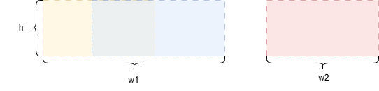
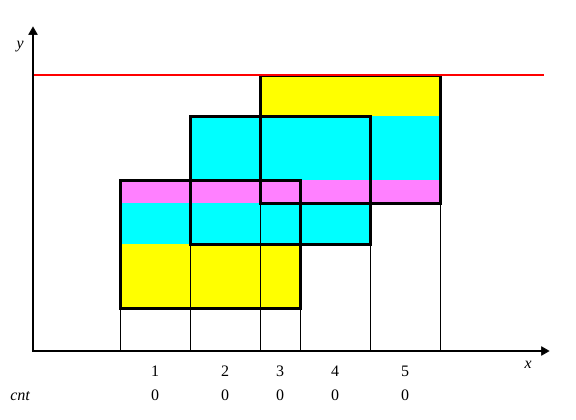

### Approach: Scanning Line + Segment Tree

#### Intuition

Since the overlapping area of squares is counted only once, we can refer to the third approach from the editorial of the problem "[850. Rectangle Area II](https://leetcode.com/problems/rectangle-area-ii/editorial/)", which uses a segment tree together with a scan line algorithm.



Consider the figure above. To compute the covered area at a given moment, we only need to know the total horizontal coverage, such as $w_1 + w_2$. The covered area for that vertical slice is then $h \times (w_1 + w_2)$. Using a scan line algorithm, we can compute the total area covered by all squares.

The plane is divided into multiple horizontal strips. The height of each strip is the vertical distance swept by the scan line, while the horizontal coverage varies dynamically. For each square, we mark its bottom edge with $+1$ and its top edge with $-1$. Whenever the scan line encounters a horizontal edge, we update the coverage count for the corresponding interval. The width of each strip is defined as the total length of x-intervals whose coverage count is greater than zero.



To implement this, we first collect and sort all distinct x-coordinates of the squares and discretize them. A segment tree is then used to maintain the dynamic horizontal coverage. As the scan line moves upward, each event updates a continuous x-interval, which is an interval update. Therefore, a segment tree with lazy propagation is required.

Each node of the segment tree maintains:

- the coverage count of the interval
- the total covered length of the interval when the coverage count is greater than zero

Using this structure, we can compute the total covered area, denoted as $\textit{totalArea}$.

Next, we need to find the smallest value of $y$ such that the covered area below $y$ is equal to the covered area above $y$. Let the covered area below a scan line at $y = y'$ be $\textit{area}$. Then the area above the scan line is $\textit{totalArea} - \textit{area}$.

The problem requires:

$\textit{area} = \textit{totalArea}− \textit{area}$

which simplifies to:

$\textit{area} = \dfrac{\textit{totalArea}}{2}$

Suppose the scan line moves from $y = y'$ to the next event at $y = y''$. Let the total horizontal coverage in this interval be $\textit{width}$. The covered area below $y = y''$ is:

$\textit{area} + \textit{width} \cdot (y^{''} - y^{'})$

If the following conditions hold:

$$
\textit{area} < \dfrac{\textit{totalArea}}{2} \\
\textit{area} + \textit{width} \cdot (y^{''} - y{'}) \ge \dfrac{\textit{totalArea}}{2}
$$

then the target value of $y$ lies within the interval $[y', y'']$.

Since the horizontal coverage remains constant within this interval, moving the scan line upward by $\Delta$ increases the covered area by $\Delta \cdot \textit{width}$. To reach exactly half of the total area, the scan line must move up by:

$\Delta = \frac{\frac{\textit{totalArea}}{2} - \textit{area}}{\textit{width}}$

Thus, the target value of $y$ is:

$y = y' + \frac{\frac{\textit{totalArea}}{2} - \textit{area}}{\textit{width}} = y' + \frac{\textit{totalArea} - 2 \cdot \textit{area}}{2 \cdot \textit{width}}$

In practice, we can avoid performing a second scan by recording the covered area and horizontal coverage for each height interval during the first scan, and then locating the correct interval using traversal or binary search.

#### Implementation

```python
from typing import List
import bisect

class SegmentTree:
    def __init__(self, xs: List[int]):
        self.xs = xs
        self.n = len(xs) - 1
        self.count = [0] * (4 * self.n)
        self.covered = [0] * (4 * self.n)

    def update(self, qleft, qright, qval, left, right, pos):
        if self.xs[right + 1] <= qleft or self.xs[left] >= qright:
            return
        if qleft <= self.xs[left] and self.xs[right + 1] <= qright:
            self.count[pos] += qval
        else:
            mid = (left + right) // 2
            self.update(qleft, qright, qval, left, mid, pos * 2 + 1)
            self.update(qleft, qright, qval, mid + 1, right, pos * 2 + 2)

        if self.count[pos] > 0:
            self.covered[pos] = self.xs[right + 1] - self.xs[left]
        else:
            if left == right:
                self.covered[pos] = 0
            else:
                self.covered[pos] = (
                    self.covered[pos * 2 + 1] + self.covered[pos * 2 + 2]
                )

    def query(self):
        return self.covered[0]

class Solution:
    def separateSquares(self, squares: List[List[int]]) -> float:
        events = []
        xs_set = set()
        for x, y, l in squares:
            events.append((y, 1, x, x + l))
            events.append((y + l, -1, x, x + l))
            xs_set.update([x, x + l])
        xs = sorted(xs_set)

        seg_tree = SegmentTree(xs)
        events.sort()

        psum = []
        widths = []
        total_area = 0.0
        prev_y = events[0][0]

        # scan: calculate total area and record intermediate states
        for y, delta, xl, xr in events:
            length = seg_tree.query()
            total_area += length * (y - prev_y)
            seg_tree.update(xl, xr, delta, 0, seg_tree.n - 1, 0)
            # record prefix sums and widths
            psum.append(total_area)
            widths.append(seg_tree.query())
            prev_y = y

        # calculate the target area (half rounded up)
        target = (total_area + 1) // 2
        # find the first position greater than or equal to target using binary search
        i = bisect.bisect_left(psum, target) - 1
        # get the corresponding area, width, and height
        area = psum[i]
        width = widths[i]
        height = events[i][0]

        return height + (total_area - area * 2) / (width * 2.0)
```

#### Complexity Analysis

Let $n$ be the length of the array $\textit{squares}$.

- Time complexity: $O(n \log n)$.

  The time complexity of sorting is $O(n \log n)$, and each update and query operation on the segment tree has a time complexity of $O(\log n)$. Since there are a total of $n$ queries and updates, the overall time complexity is $O(n \log n)$.

- Space complexity: $O(n)$.

  The space required for a segment tree is $O(n)$.

---