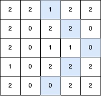
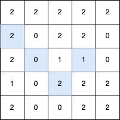
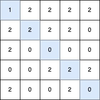

## Description

You are given a 2D integer matrix `grid` of size `n x m`, where each element is either `0`, `1`, or `2`.

A **V-shaped diagonal segment** is defined as:

- The segment starts with `1`.

- The subsequent elements follow this infinite sequence: `2, 0, 2, 0, ...`.

- The segment:

		<li>Starts **along** a diagonal direction (top-left to bottom-right, bottom-right to top-left, top-right to bottom-left, or bottom-left to top-right).

- Continues the** sequence** in the same diagonal direction.

- Makes** at most one clockwise 90-degree**** turn** to another diagonal direction while **maintaining** the sequence.

	</li>

Return the **length** of the **longest** **V-shaped diagonal segment**. If no valid segment *exists*, return 0.
### Function Contract

- `n`: Input parameter.
- Returns expected result.

### Examples

#### Example 1

**Input:** grid = [[2,2,1,2,2],[2,0,2,2,0],[2,0,1,1,0],[1,0,2,2,2],[2,0,0,2,2]]

**Output:** 5

**Explanation:**

The longest V-shaped diagonal segment has a length of 5 and follows these coordinates: `(0,2) → (1,3) → (2,4)`, takes a **90-degree clockwise turn** at `(2,4)`, and continues as `(3,3) → (4,2)`.

#### Example 2

**Input:** grid = [[2,2,2,2,2],[2,0,2,2,0],[2,0,1,1,0],[1,0,2,2,2],[2,0,0,2,2]]

**Output:** 4

**Explanation:**

**

**

The longest V-shaped diagonal segment has a length of 4 and follows these coordinates: `(2,3) → (3,2)`, takes a **90-degree clockwise turn** at `(3,2)`, and continues as `(2,1) → (1,0)`.

#### Example 3

**Input:** grid = [[1,2,2,2,2],[2,2,2,2,0],[2,0,0,0,0],[0,0,2,2,2],[2,0,0,2,0]]

**Output:** 5

**Explanation:**

**

**

The longest V-shaped diagonal segment has a length of 5 and follows these coordinates: `(0,0) → (1,1) → (2,2) → (3,3) → (4,4)`.

#### Example 4

**Input:** grid = [[1]]

**Output:** 1

**Explanation:**

The longest V-shaped diagonal segment has a length of 1 and follows these coordinates: `(0,0)`.

### Constraints

- $n = \text{grid.length}$

- $m = \text{grid}[i].length$

- $1 \le n, m \le 500$

- $\text{grid}[i][j]$ is either `0`, `1` or `2`.