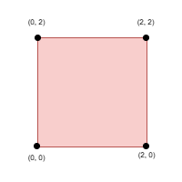
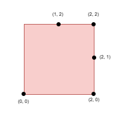
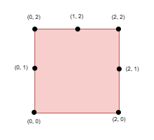

## Description

You are given an integer `side`, representing the edge length of a square with corners at `(0, 0)`, `(0, side)`, `(side, 0)`, and `(side, side)` on a Cartesian plane.

You are also given a **positive** integer `k` and a 2D integer array `points`, where $\text{points}[i] = [x_{i}, y_{i}]$ represents the coordinate of a point lying on the **boundary** of the square.

You need to select `k` elements among `points` such that the **minimum** Manhattan distance between any two points is **maximized**.

Return the **maximum** possible **minimum** Manhattan distance between the selected `k` points.

The Manhattan Distance between two cells $(x_{i}, y_{i})$ and $(x_{j}, y_{j})$ is $|x_{i} - x_{j}| + |y_{i} - y_{j}|$.
### Function Contract

- `n`: Input parameter.
- Returns expected result.

### Examples
#### Example 1

**Input:** side = 2, points = [[0,2],[2,0],[2,2],[0,0]], k = 4

**Output:** 2

**Explanation:**

Select all four points.

#### Example 2

**Input:** side = 2, points = [[0,0],[1,2],[2,0],[2,2],[2,1]], k = 4

**Output:** 1

**Explanation:**

Select the points `(0, 0)`, `(2, 0)`, `(2, 2)`, and `(2, 1)`.

#### Example 3

**Input:** side = 2, points = [[0,0],[0,1],[0,2],[1,2],[2,0],[2,2],[2,1]], k = 5

**Output:** 1

**Explanation:**

Select the points `(0, 0)`, `(0, 1)`, `(0, 2)`, `(1, 2)`, and `(2, 2)`.

### Constraints

- $1 \le side \le 10^{9}$

- $4 \le \text{points.length} \le min(4 * side, 15 * 10^{3})$

- $\text{points}[i] = [x_{i}, y_{i}]$

- The input is generated such that:

		<li>$\text{points}[i]$ lies on the boundary of the square.

- All $\text{points}[i]$ are **unique**.

	</li>
- $4 \le k \le min(25, \text{points.length})$