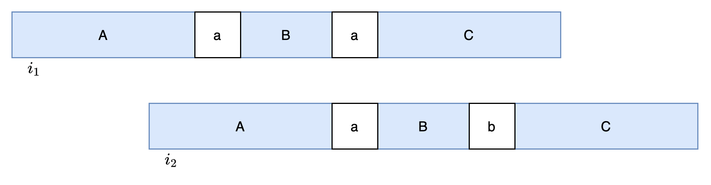

### Approach: Greedy

#### Intuition

We first process the `'T'` constraints, followed by the `'F'` constraints.

We traverse all `'T'` positions in $\textit{str}_1$ and fill $\textit{str}_2$ into the target string $\textit{word}$. If a conflict occurs during this process, meaning a different character has already been assigned to the same position, then no valid solution exists, and we return an empty string. We also maintain a $\textit{fixed}$ array to record which positions are fixed by `'T'` constraints.

Next, for all positions that are not fixed, we assign the character `'a'` by default to ensure the lexicographically smallest result.

We then process the `'F'` constraints. For each position $i$ where $\textit{str}\text{_1}[i] = 'F'$, we check whether the substring $\textit{word}[i \dots i + m - 1]$ is exactly equal to $\textit{str}_2$. If it is not equal, no action is needed. However, if it is equal, we must modify at least one non-fixed character within this window to break the match.

To maintain the smallest lexicographical order, we choose to modify the **rightmost non-fixed character** in the window, changing it to `'b'`.

A natural concern is whether modifying the rightmost non-fixed character could invalidate a previously satisfied `'F'` constraint. We now show that this cannot happen.

Suppose $\textit{str}_1$ contains two `'F'` positions at indices $i_1$ and $i_2$. When processing $i_2$, we modify a character in its window, which could potentially make the substring at $i_1$ equal to $\textit{str}_2$, violating the `'F'` constraint.

Consider $\textit{str}_2 = A + 'a' + B + 'b' + C$.
At index $i_1$, the substring is $A + 'a' + B + 'a' + C$, and at index $i_2$, it is $A + 'a' + B + 'b' + C$. We modify the `'a'` in the $i_2$ window to `'b'`, which may affect the substring at $i_1$.

From this structure, we can derive the following:



As shown in the figure, we can obtain the following information:

1. Since the rightmost non-fixed character in the $i_2$ window is the first `'a'`, there are no non-fixed characters to its right within the window. Also, the prefix $B + 'b' + C$ must match a prefix of $\textit{str}_2$ due to `'T'` constraints.
2. The string $A$ must be a suffix of $A + 'a' + B$.

We now consider three cases based on the relative lengths of $A$ and $B$:

1. **Length of $A$ equals length of $B$**
   Since $B + 'b' + C$ is a prefix of $\textit{str}_2 = A + 'a' + B + 'b' + C$, this implies $'b' = 'a'$, which is impossible.

2. **Length of $A$ is greater than length of $B$**
   Since both $A$ and $B + 'b' + C$ are prefixes of $\textit{str}_2$, let $A = B + 'b' + D$.
   Because $A$ is also a suffix of $A + 'a' + B$, we obtain:
   $B + 'b' + D = D + 'a' + B$
   Removing common parts leads to $'b' = 'a'$, which is impossible.

3. **Length of $A$ is less than length of $B$**
   Since $A$ is a suffix of $A + 'a' + B$, let $B = D + A$.
   Since $B + 'b' + C$ is a prefix of $\textit{str}_2$, we obtain:
   $(D + A) + 'b' = A + 'a' + D$
   Again, this leads to $'b' = 'a'$, which is impossible.

In all cases, we reach a contradiction. Therefore, modifying the rightmost non-fixed character will never violate any previously satisfied `'F'` constraint, while also minimizing the lexicographical impact.

#### Implementation

```python
class Solution:
    def generateString(self, str1: str, str2: str) -> str:
        n, m = len(str1), len(str2)
        s = ["a"] * (n + m - 1)
        fixed = [False] * (n + m - 1)

        # process the case of 'T'
        for i, ch in enumerate(str1):
            if ch == "T":
                for j, c in enumerate(str2, i):
                    if fixed[j] and s[j] != c:
                        return ""
                    s[j], fixed[j] = c, True

        # process the case of 'F'
        for i, ch in enumerate(str1):
            if ch == "F":
                # check if there are already different characters
                if any(str2[j - i] != s[j] for j in range(i, i + m)):
                    continue

                # find the first modifiable position
                for j in range(i + m - 1, i - 1, -1):
                    if not fixed[j]:
                        s[j] = "b"
                        break
                else:
                    return ""

        return "".join(s)
```

#### Complexity Analysis

Let $n$ be the length of $\textit{str}_1$, and $m$ be the length of $\textit{str}_2$.

- Time complexity: $O(nm)$.

- Space complexity: $O(n + m)$.

---