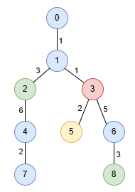
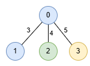

## Description

You are given an undirected tree rooted at node `0`, with `n` nodes numbered from `0` to $n - 1$. This is represented by a 2D array `edges` of length $n - 1$, where $\text{edges}[i] = [u_{i}, v_{i}, \text{length}_{i}]$ indicates an edge between nodes $u_{i}$ and $v_{i}$ with length $\text{length}_{i}$. You are also given an integer array `nums`, where $\text{nums}[i]$ represents the value at node `i`.

A **special path** is defined as a **downward** path from an ancestor node to a descendant node in which all node values are **distinct**, except for **at most** one value that may appear twice.

Return an array `result` of size 2, where $\text{result}[0]$ is the **length** of the **longest** special path, and $\text{result}[1]$ is the **minimum** number of nodes in all *possible* **longest** special paths.
### Function Contract

- `n`: Input parameter.
- Returns expected result.

### Examples

#### Example 1

**Input:** edges = [[0,1,1],[1,2,3],[1,3,1],[2,4,6],[4,7,2],[3,5,2],[3,6,5],[6,8,3]], nums = [1,1,0,3,1,2,1,1,0]

**Output:** [9,3]

**Explanation:**

In the image below, nodes are colored by their corresponding values in `nums`.

The longest special paths are `1 -> 2 -> 4` and `1 -> 3 -> 6 -> 8`, both having a length of 9. The minimum number of nodes across all longest special paths is 3.

#### Example 2

**Input:** edges = [[1,0,3],[0,2,4],[0,3,5]], nums = [1,1,0,2]

**Output:** [5,2]

**Explanation:**

The longest path is `0 -> 3` consisting of 2 nodes with a length of 5.

### Constraints

- $2 \le n \le 5 * 10^{4}$

- $\text{edges.length} = n - 1$

- $\text{edges}[i].length = 3$

- $0 \le u_{i}, v_{i} < n$

- $1 \le \text{length}_{i} \le 10^{3}$

- $\text{nums.length} = n$

- $0 \le \text{nums}[i] \le 5 * 10^{4}$

- The input is generated such that `edges` represents a valid tree.