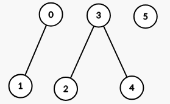
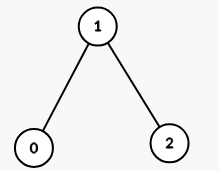

## Description

You are given a 2D integer array `properties` having dimensions `n x m` and an integer `k`.

Define a function `intersect(a, b)` that returns the **number of distinct integers** common to both arrays `a` and `b`.

Construct an **undirected** graph where each index `i` corresponds to $\text{properties}[i]$. There is an edge between node `i` and node `j` if and only if $intersect(\text{properties}[i], \text{properties}[j]) \ge k$, where `i` and `j` are in the range `[0, n - 1]` and $i \neq j$.

Return the number of **connected components** in the resulting graph.
### Function Contract

- `n`: Input parameter.
- Returns expected result.

### Examples

#### Example 1

**Input:** properties = [[1,2],[1,1],[3,4],[4,5],[5,6],[7,7]], k = 1

**Output:** 3

**Explanation:**

The graph formed has 3 connected components:

#### Example 2

**Input:** properties = [[1,2,3],[2,3,4],[4,3,5]], k = 2

**Output:** 1

**Explanation:**

The graph formed has 1 connected component:

#### Example 3

**Input:** properties = [[1,1],[1,1]], k = 2

**Output:** 2

**Explanation:**

$intersect(\text{properties}[0], \text{properties}[1]) = 1$, which is less than `k`. This means there is no edge between $\text{properties}[0]$ and $\text{properties}[1]$ in the graph.

### Constraints

- $1 \le n = \text{properties.length} \le 100$

- $1 \le m = \text{properties}[i].length \le 100$

- $1 \le \text{properties}[i][j] \le 100$

- $1 \le k \le m$