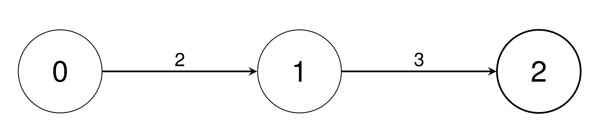

### 1. Description

There are `n` types of units indexed from `0` to $n - 1$. You are given a 2D integer array `conversions` of length $n - 1$, where $\text{conversions}[i] = [\text{sourceUnit}_{i}, \text{targetUnit}_{i}, \text{conversionFactor}_{i}]$. This indicates that a single unit of type $\text{sourceUnit}_{i}$ is equivalent to $\text{conversionFactor}_{i}$ units of type $\text{targetUnit}_{i}$.

Return an array `baseUnitConversion` of length `n`, where $\text{baseUnitConversion}[i]$ is the number of units of type `i` equivalent to a single unit of type 0. Since the answer may be large, return each $\text{baseUnitConversion}[i]$ **modulo** $10^{9} + 7$.

### 2. Function Contract

- `n`: Input parameter.
- Returns expected result.

### 3. Examples

#### Example 1

**Input:** conversions = [[0,1,2],[1,2,3]]

**Output:** [1,2,6]

**Explanation:**

- Convert a single unit of type 0 into 2 units of type 1 using $\text{conversions}[0]$.

- Convert a single unit of type 0 into 6 units of type 2 using $\text{conversions}[0]$, then $\text{conversions}[1]$.

#### Example 2

**Input:** conversions = [[0,1,2],[0,2,3],[1,3,4],[1,4,5],[2,5,2],[4,6,3],[5,7,4]]

**Output:** [1,2,3,8,10,6,30,24]

**Explanation:**

- Convert a single unit of type 0 into 2 units of type 1 using $\text{conversions}[0]$.

- Convert a single unit of type 0 into 3 units of type 2 using $\text{conversions}[1]$.

- Convert a single unit of type 0 into 8 units of type 3 using $\text{conversions}[0]$, then $\text{conversions}[2]$.

- Convert a single unit of type 0 into 10 units of type 4 using $\text{conversions}[0]$, then $\text{conversions}[3]$.

- Convert a single unit of type 0 into 6 units of type 5 using $\text{conversions}[1]$, then $\text{conversions}[4]$.

- Convert a single unit of type 0 into 30 units of type 6 using $\text{conversions}[0]$, $\text{conversions}[3]$, then $\text{conversions}[5]$.

- Convert a single unit of type 0 into 24 units of type 7 using $\text{conversions}[1]$, $\text{conversions}[4]$, then $\text{conversions}[6]$.

### 4. Constraints

- $2 \le n \le 10^{5}$

- $\text{conversions.length} = n - 1$

- $0 \le \text{sourceUnit}_{i}, \text{targetUnit}_{i} < n$

- $1 \le \text{conversionFactor}_{i} \le 10^{9}$

- It is guaranteed that unit 0 can be converted into any other unit through a **unique** combination of conversions without using any conversions in the opposite direction.