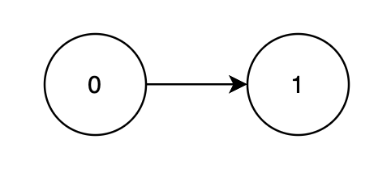
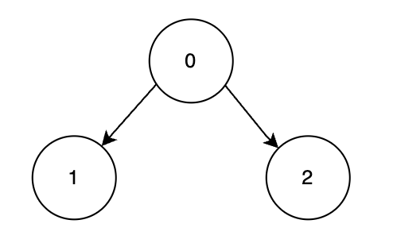

## Description

You are given a **Directed Acyclic Graph (DAG)** with `n` nodes labeled from `0` to $n - 1$, represented by a 2D array `edges`, where $\text{edges}[i] = [u_{i}, v_{i}]$ indicates a directed edge from node $u_{i}$ to $v_{i}$. Each node has an associated **score** given in an array `score`, where $\text{score}[i]$ represents the score of node `i`.

You must process the nodes in a **valid topological order**. Each node is assigned a **1-based position** in the processing order.

The **profit** is calculated by summing up the product of each node's score and its position in the ordering.

Return the **maximum **possible profit achievable with an optimal topological order.

A **topological order** of a DAG is a linear ordering of its nodes such that for every directed edge `u → v`, node `u` comes before `v` in the ordering.
### Function Contract

- `n`: Input parameter.
- Returns expected result.

### Examples

#### Example 1

**Input:** n = 2, edges = [[0,1]], score = [2,3]

**Output:** 8

**Explanation:**

Node 1 depends on node 0, so a valid order is `[0, 1]`.

<table style="border: 1px solid black;">
	<thead>
		<tr>
			<th style="border: 1px solid black;">Node</th>
			<th style="border: 1px solid black;">Processing Order</th>
			<th style="border: 1px solid black;">Score</th>
			<th style="border: 1px solid black;">Multiplier</th>
			<th style="border: 1px solid black;">Profit Calculation</th>
		</tr>
	</thead>
	<tbody>
		<tr>
			<td style="border: 1px solid black;">0</td>
			<td style="border: 1px solid black;">1st</td>
			<td style="border: 1px solid black;">2</td>
			<td style="border: 1px solid black;">1</td>
			<td style="border: 1px solid black;">2 × 1 = 2</td>
		</tr>
		<tr>
			<td style="border: 1px solid black;">1</td>
			<td style="border: 1px solid black;">2nd</td>
			<td style="border: 1px solid black;">3</td>
			<td style="border: 1px solid black;">2</td>
			<td style="border: 1px solid black;">3 × 2 = 6</td>
		</tr>
	</tbody>
</table>

The maximum total profit achievable over all valid topological orders is $2 + 6 = 8$.

#### Example 2

**Input:** n = 3, edges = [[0,1],[0,2]], score = [1,6,3]

**Output:** 25

**Explanation:**

Nodes 1 and 2 depend on node 0, so the most optimal valid order is `[0, 2, 1]`.

<table data-end="1197" data-start="851" node="[object Object]" style="border: 1px solid black;">
	<thead data-end="920" data-start="851">
		<tr data-end="920" data-start="851">
			<th data-end="858" data-start="851" style="border: 1px solid black;">Node</th>
			<th data-end="877" data-start="858" style="border: 1px solid black;">Processing Order</th>
			<th data-end="885" data-start="877" style="border: 1px solid black;">Score</th>
			<th data-end="898" data-start="885" style="border: 1px solid black;">Multiplier</th>
			<th data-end="920" data-start="898" style="border: 1px solid black;">Profit Calculation</th>
		</tr>
	</thead>
	<tbody data-end="1197" data-start="991">
		<tr data-end="1059" data-start="991">
			<td style="border: 1px solid black;">0</td>
			<td style="border: 1px solid black;">1st</td>
			<td style="border: 1px solid black;">1</td>
			<td style="border: 1px solid black;">1</td>
			<td style="border: 1px solid black;">1 × 1 = 1</td>
		</tr>
		<tr data-end="1128" data-start="1060">
			<td style="border: 1px solid black;">2</td>
			<td style="border: 1px solid black;">2nd</td>
			<td style="border: 1px solid black;">3</td>
			<td style="border: 1px solid black;">2</td>
			<td style="border: 1px solid black;">3 × 2 = 6</td>
		</tr>
		<tr data-end="1197" data-start="1129">
			<td style="border: 1px solid black;">1</td>
			<td style="border: 1px solid black;">3rd</td>
			<td style="border: 1px solid black;">6</td>
			<td style="border: 1px solid black;">3</td>
			<td style="border: 1px solid black;">6 × 3 = 18</td>
		</tr>
	</tbody>
</table>

The maximum total profit achievable over all valid topological orders is $1 + 6 + 18 = 25$.

### Constraints

- $1 \le n = \text{score.length} \le 22$

- $1 \le \text{score}[i] \le 10^{5}$

- $0 \le \text{edges.length} \le n * (n - 1) / 2$

- $\text{edges}[i] = [u_{i}, v_{i}]$ denotes a directed edge from $u_{i}$ to $v_{i}$.

- $0 \le u_{i}, v_{i} < n$

- $u_{i} \neq v_{i}$

- The input graph is **guaranteed** to be a **DAG**.

- There are no duplicate edges.