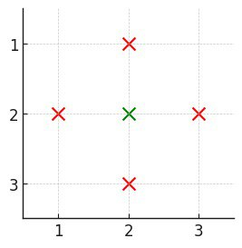
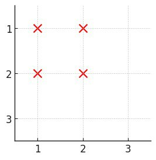
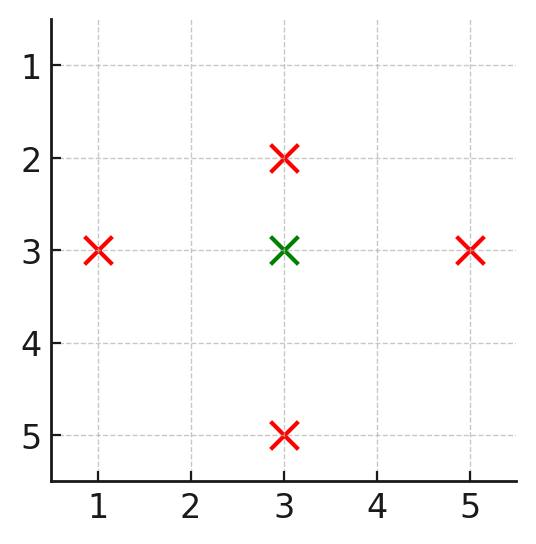

### 1. Description

You are given a positive integer `n`, representing an `n x n` city. You are also given a 2D grid `buildings`, where $\text{buildings}[i] = [x, y]$ denotes a **unique** building located at coordinates `[x, y]`.

A building is **covered** if there is at least one building in all **four** directions: left, right, above, and below.

Return the number of **covered** buildings.

### 2. Function Contract

**Inputs**

- `n`: Input parameter (`int`).
- `buildings`: Input parameter (`List[List[int]]`).

**Return value**

- Returns `int`.

### 3. Examples

#### Example 1

- **Input:** n = 3, buildings = [[1,2],[2,2],[3,2],[2,1],[2,3]]

- **Output:** 1

- **Explanation:** 

- Only building `[2,2]` is covered as it has at least one building:

		- above (`[1,2]`)

- below (`[3,2]`)

- left (`[2,1]`)

- right (`[2,3]`)

- Thus, the count of covered buildings is 1.

#### Example 2

- **Input:** n = 3, buildings = [[1,1],[1,2],[2,1],[2,2]]

- **Output:** 0

- **Explanation:** 

- No building has at least one building in all four directions.

#### Example 3

- **Input:** n = 5, buildings = [[1,3],[3,2],[3,3],[3,5],[5,3]]

- **Output:** 1

- **Explanation:** 

- Only building `[3,3]` is covered as it has at least one building:

		- above (`[1,3]`)

- below (`[5,3]`)

- left (`[3,2]`)

- right (`[3,5]`)

- Thus, the count of covered buildings is 1.

### 4. Constraints

- $2 \le n \le 10^{5}$

- $1 \le \text{buildings.length} \le 10^{5}$

- $\text{buildings}[i] = [x, y]$

- $1 \le x, y \le n$

- All coordinates of `buildings` are **unique**.
