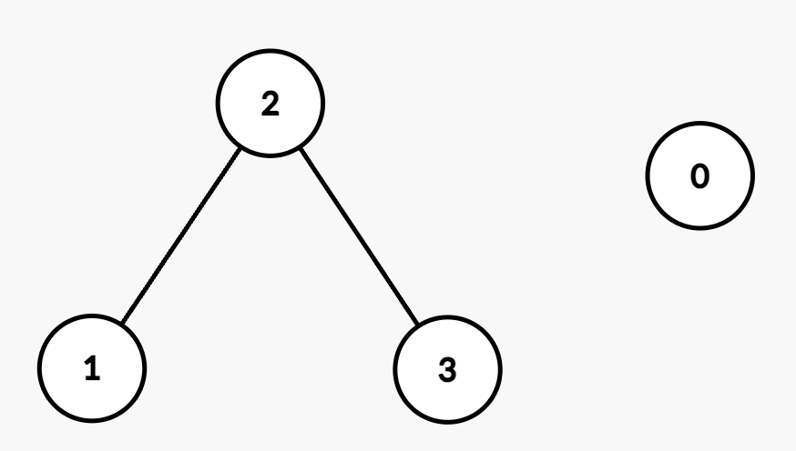

## Description

You are given an integer `n` representing the number of nodes in a graph, labeled from 0 to $n - 1$.

You are also given an integer array `nums` of length `n` sorted in **non-decreasing** order, and an integer `maxDiff`.

An **undirected **edge exists between nodes `i` and `j` if the **absolute** difference between $\text{nums}[i]$ and $\text{nums}[j]$ is **at most** `maxDiff` (i.e., $|\text{nums}[i] - \text{nums}[j]| \le maxDiff$).

You are also given a 2D integer array `queries`. For each $\text{queries}[i] = [u_{i}, v_{i}]$, determine whether there exists a path between nodes $u_{i}$ and $v_{i}$.

Return a boolean array `answer`, where $\text{answer}[i]$ is `true` if there exists a path between $u_{i}$ and $v_{i}$ in the $$i^{\text{th}}$$ query and `false` otherwise.
### Function Contract

- `n`: Input parameter.
- Returns expected result.

### Examples

#### Example 1

**Input:** n = 2, nums = [1,3], maxDiff = 1, queries = [[0,0],[0,1]]

**Output:** [true,false]

**Explanation:**

- Query `[0,0]`: Node 0 has a trivial path to itself.

- Query `[0,1]`: There is no edge between Node 0 and Node 1 because $|\text{nums}[0] - \text{nums}[1]| = |1 - 3| = 2$, which is greater than `maxDiff`.

- Thus, the final answer after processing all the queries is `[true, false]`.

#### Example 2

**Input:** n = 4, nums = [2,5,6,8], maxDiff = 2, queries = [[0,1],[0,2],[1,3],[2,3]]

**Output:** [false,false,true,true]

**Explanation:**

The resulting graph is:

- Query `[0,1]`: There is no edge between Node 0 and Node 1 because $|\text{nums}[0] - \text{nums}[1]| = |2 - 5| = 3$, which is greater than `maxDiff`.

- Query `[0,2]`: There is no edge between Node 0 and Node 2 because $|\text{nums}[0] - \text{nums}[2]| = |2 - 6| = 4$, which is greater than `maxDiff`.

- Query `[1,3]`: There is a path between Node 1 and Node 3 through Node 2 since $|\text{nums}[1] - \text{nums}[2]| = |5 - 6| = 1$ and $|\text{nums}[2] - \text{nums}[3]| = |6 - 8| = 2$, both of which are within `maxDiff`.

- Query `[2,3]`: There is an edge between Node 2 and Node 3 because $|\text{nums}[2] - \text{nums}[3]| = |6 - 8| = 2$, which is equal to `maxDiff`.

- Thus, the final answer after processing all the queries is `[false, false, true, true]`.

### Constraints

- $1 \le n = \text{nums.length} \le 10^{5}$

- $0 \le \text{nums}[i] \le 10^{5}$

- `nums` is sorted in **non-decreasing** order.

- $0 \le maxDiff \le 10^{5}$

- $1 \le \text{queries.length} \le 10^{5}$

- $\text{queries}[i] = [u_{i}, v_{i}]$

- $0 \le u_{i}, v_{i} < n$