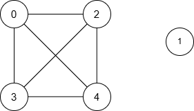
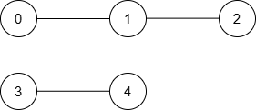

### 1. Description

You are given an integer `n` representing the number of nodes in a graph, labeled from 0 to $n - 1$.

You are also given an integer array `nums` of length `n` and an integer `maxDiff`.

An **undirected **edge exists between nodes `i` and `j` if the **absolute** difference between $\text{nums}[i]$ and $\text{nums}[j]$ is **at most** `maxDiff` (i.e., $|\text{nums}[i] - \text{nums}[j]| \le maxDiff$).

You are also given a 2D integer array `queries`. For each $\text{queries}[i] = [u_{i}, v_{i}]$, find the **minimum** distance between nodes $u_{i}$ and $v_{i}$_. If no path exists between the two nodes, return -1 for that query.

Return an array `answer`, where $\text{answer}[i]$ is the result of the $i^{\text{th}}$ query.

### 2. Function Contract

**Inputs**

- `n`: Input parameter (`int`).
- `nums`: Input parameter (`List[int]`).
- `maxDiff`: Input parameter (`int`).
- `queries`: Input parameter (`List[List[int]]`).

**Return value**

- Returns `List[int]`.

### 3. Note

The edges between the nodes are unweighted.

### 4. Examples

#### Example 1

- **Input:** n = 5, nums = [1,8,3,4,2], maxDiff = 3, queries = [[0,3],[2,4]]

- **Output:** [1,1]

- **Explanation:** The resulting graph is:

<table>
	<tbody>
		<tr>
			<th>Query</th>
			<th>Shortest Path</th>
			<th>Minimum Distance</th>
		</tr>
		<tr>
			<td>[0, 3]</td>
			<td>0 → 3</td>
			<td>1</td>
		</tr>
		<tr>
			<td>[2, 4]</td>
			<td>2 → 4</td>
			<td>1</td>
		</tr>
	</tbody>
</table>

Thus, the output is `[1, 1]`.

#### Example 2

- **Input:** n = 5, nums = [5,3,1,9,10], maxDiff = 2, queries = [[0,1],[0,2],[2,3],[4,3]]

- **Output:** [1,2,-1,1]

- **Explanation:** The resulting graph is:

<table>
	<tbody>
		<tr>
			<th>Query</th>
			<th>Shortest Path</th>
			<th>Minimum Distance</th>
		</tr>
		<tr>
			<td>[0, 1]</td>
			<td>0 → 1</td>
			<td>1</td>
		</tr>
		<tr>
			<td>[0, 2]</td>
			<td>0 → 1 → 2</td>
			<td>2</td>
		</tr>
		<tr>
			<td>[2, 3]</td>
			<td>None</td>
			<td>-1</td>
		</tr>
		<tr>
			<td>[4, 3]</td>
			<td>3 → 4</td>
			<td>1</td>
		</tr>
	</tbody>
</table>

Thus, the output is `[1, 2, -1, 1]`.

#### Example 3

- **Input:** n = 3, nums = [3,6,1], maxDiff = 1, queries = [[0,0],[0,1],[1,2]]

- **Output:** [0,-1,-1]

- **Explanation:** There are no edges between any two nodes because:

- Nodes 0 and 1: $|\text{nums}[0] - \text{nums}[1]| = |3 - 6| = 3 > 1$

- Nodes 0 and 2: $|\text{nums}[0] - \text{nums}[2]| = |3 - 1| = 2 > 1$

- Nodes 1 and 2: $|\text{nums}[1] - \text{nums}[2]| = |6 - 1| = 5 > 1$

Thus, no node can reach any other node, and the output is `[0, -1, -1]`.

### 5. Constraints

- $1 \le n = \text{nums.length} \le 10^{5}$

- $0 \le \text{nums}[i] \le 10^{5}$

- $0 \le maxDiff \le 10^{5}$

- $1 \le \text{queries.length} \le 10^{5}$

- $\text{queries}[i] = [u_{i}, v_{i}]$

- $0 \le u_{i}, v_{i} < n$
