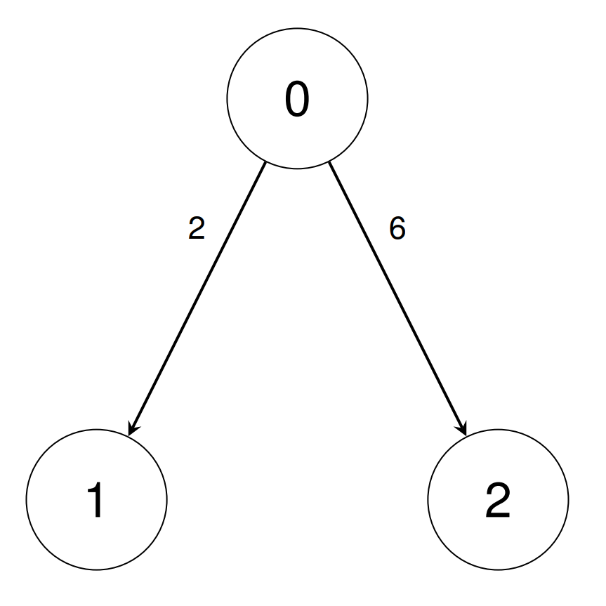
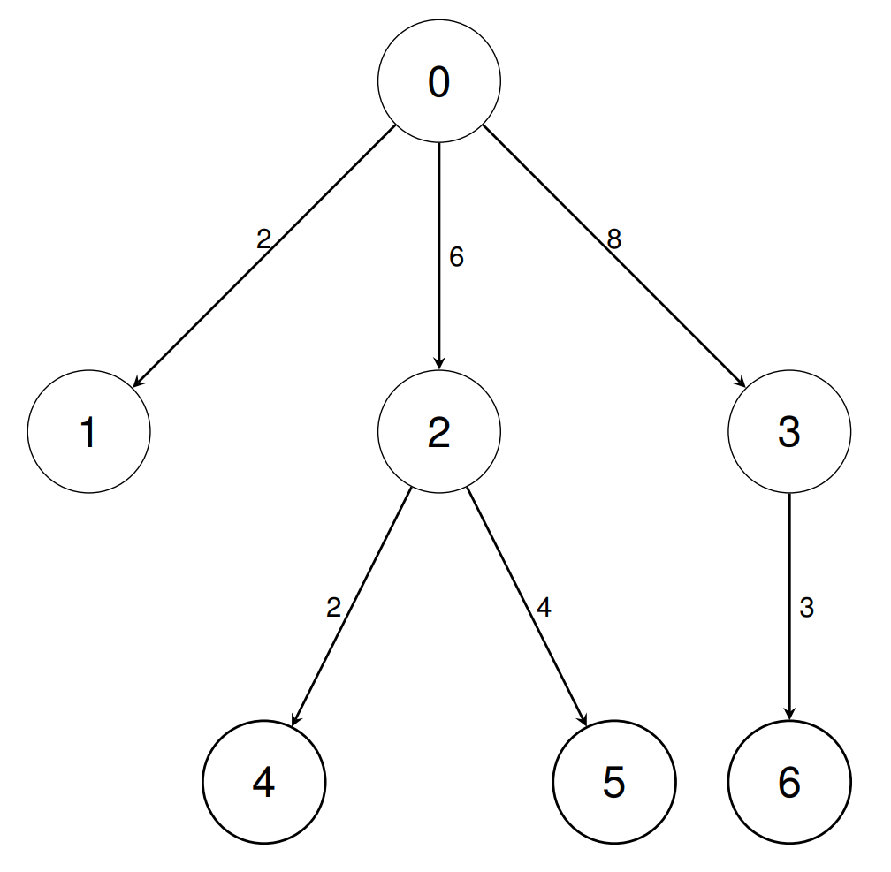

## Description

There are `n` types of units indexed from `0` to $n - 1$.

You are given a 2D integer array `conversions` of length $n - 1$, where $\text{conversions}[i] = [\text{sourceUnit}_{i}, \text{targetUnit}_{i}, \text{conversionFactor}_{i}]$. This indicates that a single unit of type $\text{sourceUnit}_{i}$ is equivalent to $\text{conversionFactor}_{i}$ units of type $\text{targetUnit}_{i}$.

You are also given a 2D integer array `queries` of length `q`, where $\text{queries}[i] = [\text{unitA}_{i}, \text{unitB}_{i}]$.

Return an array `answer` of length `q` where $\text{answer}[i]$ is the number of units of type $\text{unitB}_{i}$ equivalent to 1 unit of type $\text{unitA}_{i}$, and can be represented as `p/q` where `p` and `q` are coprime. Return each $\text{answer}[i]$ as $pq^-1$ **modulo** $10^{9} + 7$, where $q^{-1}$ represents the multiplicative inverse of `q` modulo $10^{9} + 7$.
### Function Contract

- Refer to method signature.

### Examples
#### Example 1

**Input:** conversions = [[0,1,2],[0,2,6]], queries = [[1,2],[1,0]]

**Output:** [3,500000004]

**Explanation:**

- In the first query, we can convert unit 1 into 3 units of type 2 using the inverse of $\text{conversions}[0]$, then $\text{conversions}[1]$.

- In the second query, we can convert unit 1 into 1/2 units of type 0 using the inverse of $\text{conversions}[0]$. We return 500000004 since it is the multiplicative inverse of 2.

#### Example 2

**Input:** conversions = [[0,1,2],[0,2,6],[0,3,8],[2,4,2],[2,5,4],[3,6,3]], queries = [[1,2],[0,4],[6,5],[4,6],[6,1]]

**Output:** [3,12,1,2,83333334]

**Explanation:**

- In the first query, we can convert unit 1 into 3 units of type 2 using the inverse of $\text{conversions}[0]$, then $\text{conversions}[1]$.

- In the second query, we can convert unit 0 into 12 units of type 4 using $\text{conversions}[1]$, then $\text{conversions}[3]$.

- In the third query, we can convert unit 6 into 1 unit of type 5 using the inverse of $\text{conversions}[5]$, the inverse of $\text{conversions}[2]$, $\text{conversions}[1]$, then $\text{conversions}[4]$.

- In the fourth query, we can convert unit 4 into 2 units of type 6 using the inverse of $\text{conversions}[3]$, the inverse of $\text{conversions}[1]$, $\text{conversions}[2]$, then $\text{conversions}[5]$.

- In the fifth query, we can convert unit 6 into 1/12 units of type 1 using the inverse of $\text{conversions}[5]$, the inverse of $\text{conversions}[2]$, then $\text{conversions}[0]$. We return 83333334 since it is the multiplicative inverse of 12.

### Constraints

- $2 \le n \le 10^{5}$

- $\text{conversions.length} = n - 1$

- $0 \le \text{sourceUnit}_{i}, \text{targetUnit}_{i} < n$

- $1 \le \text{conversionFactor}_{i} \le 10^{9}$

- $1 \le q \le 10^{5}$

- $\text{queries.length} = q$

- $0 \le \text{unitA}_{i}, \text{unitB}_{i} < n$

- It is guaranteed that unit 0 can be **uniquely** converted into any other unit through a combination of forward or backward conversions.