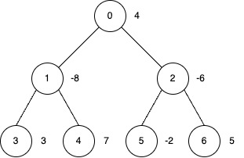
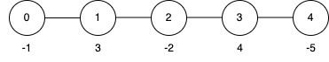

## Description

You are given an undirected tree rooted at node `0`, with `n` nodes numbered from 0 to $n - 1$. The tree is represented by a 2D integer array `edges` of length $n - 1$, where $\text{edges}[i] = [u_{i}, v_{i}]$ indicates an edge between nodes $u_{i}$ and $v_{i}$.

You are also given an integer array `nums` of length `n`, where $\text{nums}[i]$ represents the value at node `i`, and an integer `k`.

You may perform **inversion operations** on a subset of nodes subject to the following rules:

- **Subtree Inversion Operation:**

		<li data-end="887" data-start="802">
		When you invert a node, every value in the subtree rooted at that node is multiplied by -1.

	</li>
- **Distance Constraint on Inversions:**

		<li data-end="1020" data-start="934">
		You may only invert a node if it is "sufficiently far" from any other inverted node.

- Specifically, if you invert two nodes `a` and `b` such that one is an ancestor of the other (i.e., if $LCA(a, b) = a$ or $LCA(a, b) = b$), then the distance (the number of edges on the unique path between them) must be at least `k`.

	</li>

Return the **maximum** possible **sum** of the tree's node values after applying **inversion operations**.
### Function Contract

- `n`: Input parameter.
- Returns expected result.

### Examples

#### Example 1

**Input:** edges = [[0,1],[0,2],[1,3],[1,4],[2,5],[2,6]], nums = [4,-8,-6,3,7,-2,5], k = 2

**Output:** 27

**Explanation:**

- Apply inversion operations at nodes 0, 3, 4 and 6.

- The final `nums` array is `[-4, 8, 6, 3, 7, 2, 5]`, and the total sum is 27.

#### Example 2

**Input:** edges = [[0,1],[1,2],[2,3],[3,4]], nums = [-1,3,-2,4,-5], k = 2

**Output:** 9

**Explanation:**

- Apply the inversion operation at node 4.

- The final `nums` array becomes `[-1, 3, -2, 4, 5]`, and the total sum is 9.

#### Example 3

**Input:** edges = [[0,1],[0,2]], nums = [0,-1,-2], k = 3

**Output:** 3

**Explanation:**

Apply inversion operations at nodes 1 and 2.

### Constraints

- $2 \le n \le 5 * 10^{4}$

- $\text{edges.length} = n - 1$

- $\text{edges}[i] = [u_{i}, v_{i}]$

- $0 \le u_{i}, v_{i} < n$

- $\text{nums.length} = n$

- $-5 * 10^{4} \le \text{nums}[i] \le 5 * 10^{4}$

- $1 \le k \le 50$

- The input is generated such that `edges` represents a valid tree.