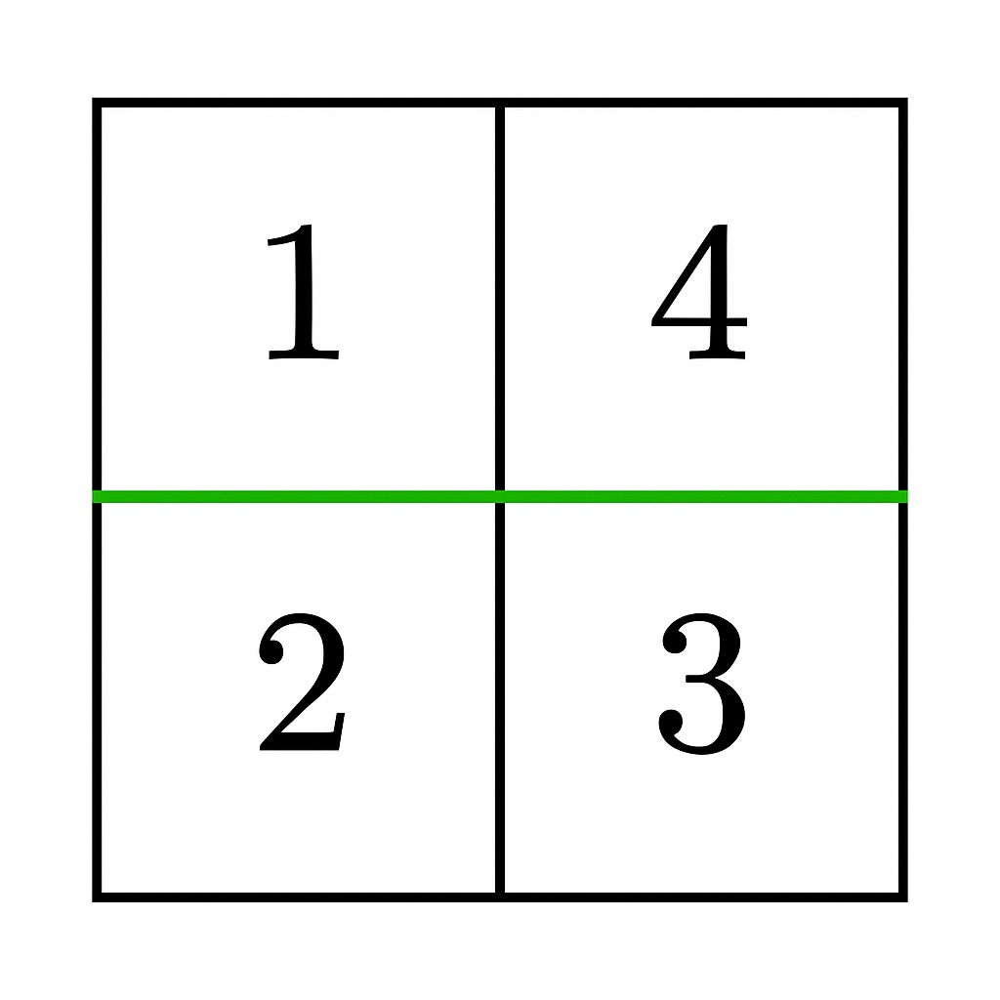

### 1. Description

You are given an `m x n` matrix `grid` of positive integers. Your task is to determine if it is possible to make **either one horizontal or one vertical cut** on the grid such that:

- Each of the two resulting sections formed by the cut is **non-empty**.

- The sum of the elements in both sections is **equal**.

Return `true` if such a partition exists; otherwise return `false`.

### 2. Function Contract

**Inputs**

- `grid`: Input parameter (`List[List[int]]`).

**Return value**

- Returns `bool`.

### 3. Examples

#### Example 1

- **Input:** grid = [[1,4],[2,3]]

- **Output:** true

- **Explanation:** 

A horizontal cut between row 0 and row 1 results in two non-empty sections, each with a sum of 5. Thus, the answer is `true`.

#### Example 2

- **Input:** grid = [[1,3],[2,4]]

- **Output:** false

- **Explanation:** No horizontal or vertical cut results in two non-empty sections with equal sums. Thus, the answer is `false`.

### 4. Constraints

- $1 \le m = \text{grid.length} \le 10^{5}$

- $1 \le n = \text{grid}[i].length \le 10^{5}$

- $2 \le m * n \le 10^{5}$

- $1 \le \text{grid}[i][j] \le 10^{5}$
