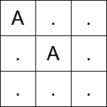
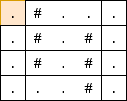

## Description

You are given a 2D character grid `matrix` of size `m x n`, represented as an array of strings, where $\text{matrix}[i][j]$ represents the cell at the intersection of the $$i^{\text{th}}$$row and$$j^{\text{th}}$$ column. Each cell is one of the following:

- `'.'` representing an empty cell.

- `'#'` representing an obstacle.

- An uppercase letter (`'A'`-`'Z'`) representing a teleportation portal.

You start at the top-left cell `(0, 0)`, and your goal is to reach the bottom-right cell $(m - 1, n - 1)$. You can move from the current cell to any adjacent cell (up, down, left, right) as long as the destination cell is within the grid bounds and is not an obstacle**.**

If you step on a cell containing a portal letter and you haven't used that portal letter before, you may instantly teleport to any other cell in the grid with the same letter. This teleportation does not count as a move, but each portal letter can be used** at most **once during your journey.

Return the **minimum** number of moves required to reach the bottom-right cell. If it is not possible to reach the destination, return `-1`.
### Function Contract

- `n`: Input parameter.
- Returns expected result.

### Examples
#### Example 1

**Input:** matrix = ["A..",".A.","..."]

**Output:** 2

**Explanation:**

- Before the first move, teleport from `(0, 0)` to `(1, 1)`.

- In the first move, move from `(1, 1)` to `(1, 2)`.

- In the second move, move from `(1, 2)` to `(2, 2)`.

#### Example 2

**Input:** matrix = [".#...",".#.#.",".#.#.","...#."]

**Output:** 13

**Explanation:**

### Constraints

- $1 \le m = \text{matrix.length} \le 10^{3}$

- $1 \le n = \text{matrix}[i].length \le 10^{3}$

- $\text{matrix}[i][j]$ is either `'#'`, `'.'`, or an uppercase English letter.

- $\text{matrix}[0][0]$ is not an obstacle.