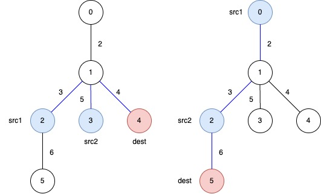
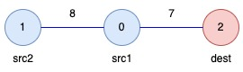

## Description

You are given an **undirected weighted** tree with `n` nodes, numbered from `0` to $n - 1$. It is represented by a 2D integer array `edges` of length $n - 1$, where $\text{edges}[i] = [u_{i}, v_{i}, w_{i}]$ indicates that there is an edge between nodes $u_{i}$ and $v_{i}$ with weight $w_{i}$.​

Additionally, you are given a 2D integer array `queries`, where $\text{queries}[j] = [\text{src1}_{j}, \text{src2}_{j}, \text{dest}_{j}]$.

Return an array `answer` of length equal to `queries.length`, where $\text{answer}[j]$ is the **minimum total weight** of a subtree such that it is possible to reach $\text{dest}_{j}$ from both $\text{src1}_{j}$ and $\text{src2}_{j}$ using edges in this subtree.

A **subtree** here is any connected subset of nodes and edges of the original tree forming a valid tree.
### Function Contract

- `n`: Input parameter.
- Returns expected result.

### Examples

#### Example 1

**Input:** edges = [[0,1,2],[1,2,3],[1,3,5],[1,4,4],[2,5,6]], queries = [[2,3,4],[0,2,5]]

**Output:** [12,11]

**Explanation:**

The blue edges represent one of the subtrees that yield the optimal answer.

- $\text{answer}[0]$: The total weight of the selected subtree that ensures a path from $src1 = 2$ and $src2 = 3$ to $dest = 4$ is $3 + 5 + 4 = 12$.

- $\text{answer}[1]$: The total weight of the selected subtree that ensures a path from $src1 = 0$ and $src2 = 2$ to $dest = 5$ is $2 + 3 + 6 = 11$.

#### Example 2

**Input:** edges = [[1,0,8],[0,2,7]], queries = [[0,1,2]]

**Output:** [15]

**Explanation:**

- $\text{answer}[0]$: The total weight of the selected subtree that ensures a path from $src1 = 0$ and $src2 = 1$ to $dest = 2$ is $8 + 7 = 15$.

### Constraints

- $3 \le n \le 10^{5}$

- $\text{edges.length} = n - 1$

- $\text{edges}[i].length = 3$

- $0 \le u_{i}, v_{i} < n$

- $1 \le w_{i} \le 10^{4}$

- $1 \le \text{queries.length} \le 10^{5}$

- $\text{queries}[j].length = 3$

- $0 \le \text{src1}_{j}, \text{src2}_{j}, \text{dest}_{j} < n$

- $\text{src1}_{j}$, $\text{src2}_{j}$, and $\text{dest}_{j}$ are pairwise distinct.

- The input is generated such that `edges` represents a valid tree.