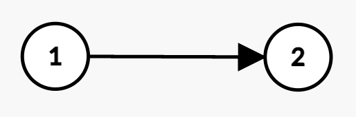
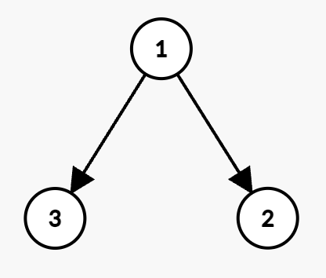
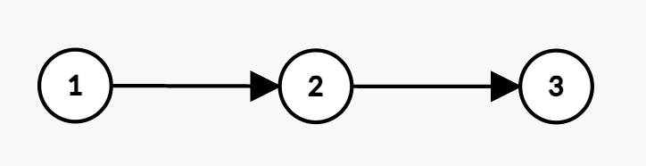

### 1. Description

You are given an integer `n`, representing the number of employees in a company. Each employee is assigned a unique ID from 1 to `n`, and employee 1 is the CEO, is the direct or indirect boss of every employee. You are given two **1-based **integer arrays, `present` and `future`, each of length `n`, where:

- $\text{present}[i]$ represents the **current** price at which the $i^{\text{th}}$ employee can buy a stock today.

- $\text{future}[i]$ represents the **expected** price at which the $i^{\text{th}}$ employee can sell the stock tomorrow.

The company's hierarchy is represented by a 2D integer array `hierarchy`, where $\text{hierarchy}[i] = [u_{i}, v_{i}]$ means that employee $u_{i}$ is the direct boss of employee $v_{i}$.

Additionally, you have an integer `budget` representing the total funds available for investment.

However, the company has a discount policy: if an employee's direct boss purchases their own stock, then the employee can buy their stock at **half** the original price ($floor(\text{present}[v] / 2)$).

Return the **maximum** profit that can be achieved without exceeding the given budget.

### 2. Function Contract

**Inputs**

- `n`: Input parameter (`int`).
- `present`: Input parameter (`List[int]`).
- `future`: Input parameter (`List[int]`).
- `hierarchy`: Input parameter (`List[List[int]]`).
- `budget`: Input parameter (`int`).

**Return value**

- Returns `int`.

### 3. Note

- You may buy each stock at most **once**.

- You **cannot** use any profit earned from future stock prices to fund additional investments and must buy only from `budget`.

### 4. Examples

#### Example 1

- **Input:** n = 2, present = [1,2], future = [4,3], hierarchy = [[1,2]], budget = 3

- **Output:** 5

- **Explanation:** 

- Employee 1 buys the stock at price 1 and earns a profit of $4 - 1 = 3$.

- Since Employee 1 is the direct boss of Employee 2, Employee 2 gets a discounted price of $floor(2 / 2) = 1$.

- Employee 2 buys the stock at price 1 and earns a profit of $3 - 1 = 2$.

- The total buying cost is $1 + 1 = 2 \le budget$. Thus, the maximum total profit achieved is $3 + 2 = 5$.

#### Example 2

- **Input:** n = 2, present = [3,4], future = [5,8], hierarchy = [[1,2]], budget = 4

- **Output:** 4

- **Explanation:** 

- Employee 2 buys the stock at price 4 and earns a profit of $8 - 4 = 4$.

- Since both employees cannot buy together, the maximum profit is 4.

#### Example 3

- **Input:** n = 3, present = [4,6,8], future = [7,9,11], hierarchy = [[1,2],[1,3]], budget = 10

- **Output:** 10

- **Explanation:** 

- Employee 1 buys the stock at price 4 and earns a profit of $7 - 4 = 3$.

- Employee 3 would get a discounted price of $floor(8 / 2) = 4$ and earns a profit of $11 - 4 = 7$.

- Employee 1 and Employee 3 buy their stocks at a total cost of $4 + 4 = 8 \le budget$. Thus, the maximum total profit achieved is $3 + 7 = 10$.

#### Example 4

- **Input:** n = 3, present = [5,2,3], future = [8,5,6], hierarchy = [[1,2],[2,3]], budget = 7

- **Output:** 12

- **Explanation:** 

- Employee 1 buys the stock at price 5 and earns a profit of $8 - 5 = 3$.

- Employee 2 would get a discounted price of $floor(2 / 2) = 1$ and earns a profit of $5 - 1 = 4$.

- Employee 3 would get a discounted price of $floor(3 / 2) = 1$ and earns a profit of $6 - 1 = 5$.

- The total cost becomes $5 + 1 + 1 = 7 \le budget$. Thus, the maximum total profit achieved is $3 + 4 + 5 = 12$.

### 5. Constraints

- $1 \le n \le 160$

- $\text{present.length}, \text{future.length} = n$

- $1 \le \text{present}[i], \text{future}[i] \le 50$

- $\text{hierarchy.length} = n - 1$

- $\text{hierarchy}[i] = [u_{i}, v_{i}]$

- $1 \le u_{i}, v_{i} \le n$

- $u_{i} \neq v_{i}$

- $1 \le budget \le 160$

- There are no duplicate edges.

- Employee 1 is the direct or indirect boss of every employee.

- The input graph `hierarchy `is **guaranteed** to have no cycles.
