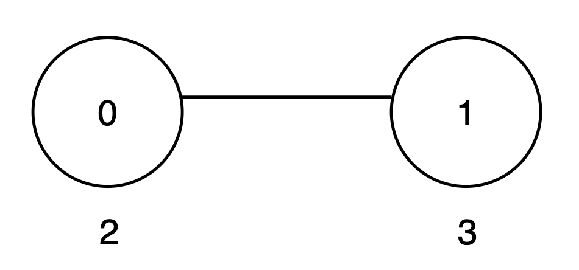
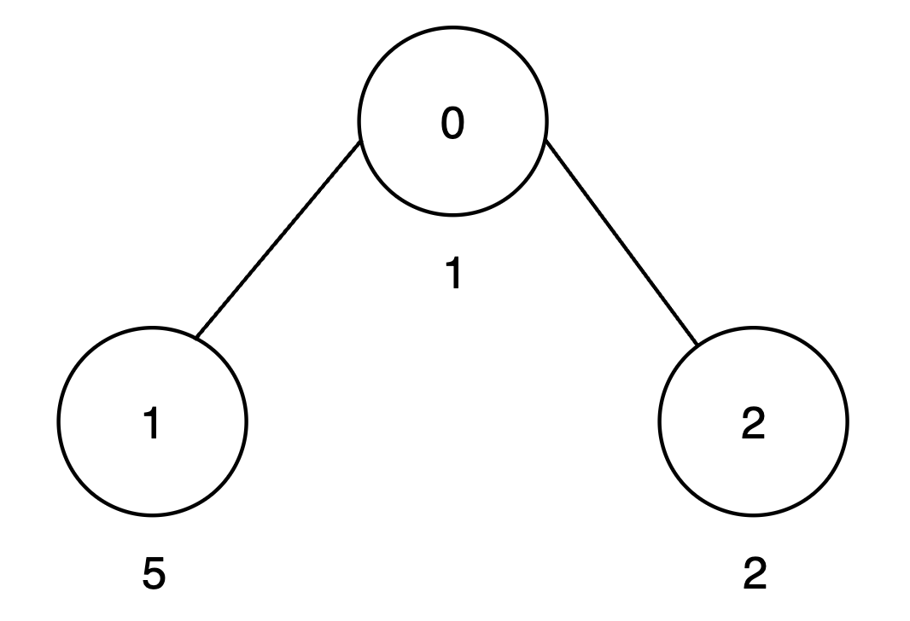
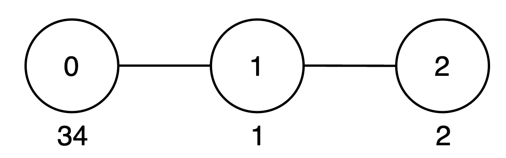

### 1. Description

You are given an undirected tree rooted at node 0 with `n` nodes numbered from 0 to $n - 1$. Each node `i` has an integer value $\text{vals}[i]$, and its parent is given by $\text{par}[i]$.

A **subset** of nodes within the **subtree** of a node is called **good** if every digit from 0 to 9 appears **at most** once in the decimal representation of the values of the selected nodes.

The **score** of a good subset is the sum of the values of its nodes.

Define an array `maxScore` of length `n`, where $\text{maxScore}[u]$ represents the **maximum** possible sum of values of a good subset of nodes that belong to the subtree rooted at node `u`, including `u` itself and all its descendants.

Return the sum of all values in `maxScore`.

Since the answer may be large, return it **modulo** $10^{9} + 7$.

### 2. Function Contract

- `n`: Input parameter.
- Returns expected result.

### 3. Examples

#### Example 1

**Input:** vals = [2,3], par = [-1,0]

**Output:** 8

**Explanation:**

- The subtree rooted at node 0 includes nodes `{0, 1}`. The subset `{2, 3}` is* *good as the digits 2 and 3 appear only once. The score of this subset is $2 + 3 = 5$.

- The subtree rooted at node 1 includes only node `{1}`. The subset `{3}` is* *good. The score of this subset is 3.

- The `maxScore` array is `[5, 3]`, and the sum of all values in `maxScore` is $5 + 3 = 8$. Thus, the answer is 8.

#### Example 2

**Input:** vals = [1,5,2], par = [-1,0,0]

**Output:** 15

**Explanation:**

**

**

- The subtree rooted at node 0 includes nodes `{0, 1, 2}`. The subset `{1, 5, 2}` is* *good as the digits 1, 5 and 2 appear only once. The score of this subset is $1 + 5 + 2 = 8$.

- The subtree rooted at node 1 includes only node `{1}`. The subset `{5}` is* *good. The score of this subset is 5.

- The subtree rooted at node 2 includes only node `{2}`. The subset `{2}` is* *good. The score of this subset is 2.

- The `maxScore` array is `[8, 5, 2]`, and the sum of all values in `maxScore` is $8 + 5 + 2 = 15$. Thus, the answer is 15.

#### Example 3

**Input:** vals = [34,1,2], par = [-1,0,1]

**Output:** 42

**Explanation:**

- The subtree rooted at node 0 includes nodes `{0, 1, 2}`. The subset `{34, 1, 2}` is* *good as the digits 3, 4, 1 and 2 appear only once. The score of this subset is $34 + 1 + 2 = 37$.

- The subtree rooted at node 1 includes node `{1, 2}`. The subset `{1, 2}` is* *good as the digits 1 and 2 appear only once. The score of this subset is $1 + 2 = 3$.

- The subtree rooted at node 2 includes only node `{2}`. The subset `{2}` is* *good. The score of this subset is 2.

- The `maxScore` array is `[37, 3, 2]`, and the sum of all values in `maxScore` is $37 + 3 + 2 = 42$. Thus, the answer is 42.

#### Example 4

**Input:** vals = [3,22,5], par = [-1,0,1]

**Output:** 18

**Explanation:**

- The subtree rooted at node 0 includes nodes `{0, 1, 2}`. The subset `{3, 22, 5}` is* *not good, as digit 2 appears twice. Therefore, the subset `{3, 5}` is valid. The score of this subset is $3 + 5 = 8$.

- The subtree rooted at node 1 includes nodes `{1, 2}`. The subset `{22, 5}` is* *not good, as digit 2 appears twice. Therefore, the subset `{5}` is valid. The score of this subset is 5.

- The subtree rooted at node 2 includes `{2}`. The subset `{5}` is* *good. The score of this subset is 5.

- The `maxScore` array is `[8, 5, 5]`, and the sum of all values in `maxScore` is $8 + 5 + 5 = 18$. Thus, the answer is 18.

### 4. Constraints

- $1 \le n = \text{vals.length} \le 500$

- $1 \le \text{vals}[i] \le 10^{9}$

- $\text{par.length} = n$

- $\text{par}[0] = -1$

- $0 \le \text{par}[i] < n$ for `i` in `[1, n - 1]`

- The input is generated such that the parent array `par` represents a valid tree.