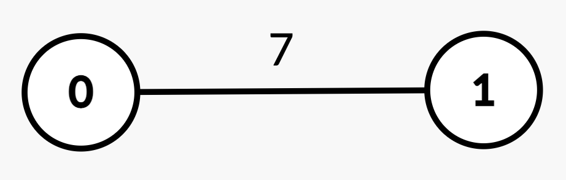
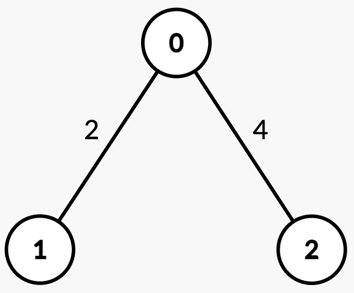
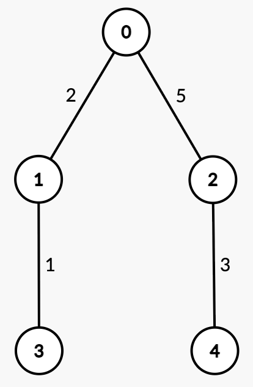

## Description

You are given an integer `n` and an **undirected, weighted** tree rooted at node 0 with `n` nodes numbered from 0 to $n - 1$. This is represented by a 2D array `edges` of length $n - 1$, where $\text{edges}[i] = [u_{i}, v_{i}, w_{i}]$ indicates an edge from node $u_{i}$ to $v_{i}$ with weight $w_{i}$.

The **weighted median node** is defined as the **first** node `x` on the path from $u_{i}$ to $v_{i}$ such that the sum of edge weights from $u_{i}$ to `x` is **greater than or equal to half** of the total path weight.

You are given a 2D integer array `queries`. For each $\text{queries}[j] = [u_{j}, v_{j}]$, determine the weighted median node along the path from $u_{j}$ to $v_{j}$.

Return an array `ans`, where $\text{ans}[j]$ is the node index of the weighted median for $\text{queries}[j]$.
### Function Contract

- `n`: Input parameter.
- Returns expected result.

### Examples

#### Example 1

**Input:** n = 2, edges = [[0,1,7]], queries = [[1,0],[0,1]]

**Output:** [0,1]

**Explanation:**

<table style="border: 1px solid black;">
	<thead>
		<tr>
			<th style="border: 1px solid black;">Query</th>
			<th style="border: 1px solid black;">Path</th>
			<th style="border: 1px solid black;">Edge

			Weights</th>
			<th style="border: 1px solid black;">Total

			Path

			Weight</th>
			<th style="border: 1px solid black;">Half</th>
			<th style="border: 1px solid black;">Explanation</th>
			<th style="border: 1px solid black;">Answer</th>
		</tr>
	</thead>
	<tbody>
		<tr>
			<td style="border: 1px solid black;">`[1, 0]`</td>
			<td style="border: 1px solid black;">`1 → 0`</td>
			<td style="border: 1px solid black;">`[7]`</td>
			<td style="border: 1px solid black;">7</td>
			<td style="border: 1px solid black;">3.5</td>
			<td style="border: 1px solid black;">Sum from $1 → 0 = 7 \ge 3.5$, median is node 0.</td>
			<td style="border: 1px solid black;">0</td>
		</tr>
		<tr>
			<td style="border: 1px solid black;">`[0, 1]`</td>
			<td style="border: 1px solid black;">`0 → 1`</td>
			<td style="border: 1px solid black;">`[7]`</td>
			<td style="border: 1px solid black;">7</td>
			<td style="border: 1px solid black;">3.5</td>
			<td style="border: 1px solid black;">Sum from $0 → 1 = 7 \ge 3.5$, median is node 1.</td>
			<td style="border: 1px solid black;">1</td>
		</tr>
	</tbody>
</table>

#### Example 2

**Input:** n = 3, edges = [[0,1,2],[2,0,4]], queries = [[0,1],[2,0],[1,2]]

**Output:** [1,0,2]

**E****xplanation:**

<table style="border: 1px solid black;">
	<thead>
		<tr>
			<th style="border: 1px solid black;">Query</th>
			<th style="border: 1px solid black;">Path</th>
			<th style="border: 1px solid black;">Edge

			Weights</th>
			<th style="border: 1px solid black;">Total

			Path

			Weight</th>
			<th style="border: 1px solid black;">Half</th>
			<th style="border: 1px solid black;">Explanation</th>
			<th style="border: 1px solid black;">Answer</th>
		</tr>
	</thead>
	<tbody>
		<tr>
			<td style="border: 1px solid black;">`[0, 1]`</td>
			<td style="border: 1px solid black;">`0 → 1`</td>
			<td style="border: 1px solid black;">`[2]`</td>
			<td style="border: 1px solid black;">2</td>
			<td style="border: 1px solid black;">1</td>
			<td style="border: 1px solid black;">Sum from $0 → 1 = 2 \ge 1$, median is node 1.</td>
			<td style="border: 1px solid black;">1</td>
		</tr>
		<tr>
			<td style="border: 1px solid black;">`[2, 0]`</td>
			<td style="border: 1px solid black;">`2 → 0`</td>
			<td style="border: 1px solid black;">`[4]`</td>
			<td style="border: 1px solid black;">4</td>
			<td style="border: 1px solid black;">2</td>
			<td style="border: 1px solid black;">Sum from $2 → 0 = 4 \ge 2$, median is node 0.</td>
			<td style="border: 1px solid black;">0</td>
		</tr>
		<tr>
			<td style="border: 1px solid black;">`[1, 2]`</td>
			<td style="border: 1px solid black;">`1 → 0 → 2`</td>
			<td style="border: 1px solid black;">`[2, 4]`</td>
			<td style="border: 1px solid black;">6</td>
			<td style="border: 1px solid black;">3</td>
			<td style="border: 1px solid black;">Sum from $1 → 0 = 2 < 3$.

			Sum from $1 → 2 = 2 + 4 = 6 \ge 3$, median is node 2.</td>
			<td style="border: 1px solid black;">2</td>
		</tr>
	</tbody>
</table>

#### Example 3

**Input:** n = 5, edges = [[0,1,2],[0,2,5],[1,3,1],[2,4,3]], queries = [[3,4],[1,2]]

**Output:** [2,2]

**Explanation:**

<table style="border: 1px solid black;">
	<thead>
		<tr>
			<th style="border: 1px solid black;">Query</th>
			<th style="border: 1px solid black;">Path</th>
			<th style="border: 1px solid black;">Edge

			Weights</th>
			<th style="border: 1px solid black;">Total

			Path

			Weight</th>
			<th style="border: 1px solid black;">Half</th>
			<th style="border: 1px solid black;">Explanation</th>
			<th style="border: 1px solid black;">Answer</th>
		</tr>
	</thead>
	<tbody>
		<tr>
			<td style="border: 1px solid black;">`[3, 4]`</td>
			<td style="border: 1px solid black;">`3 → 1 → 0 → 2 → 4`</td>
			<td style="border: 1px solid black;">`[1, 2, 5, 3]`</td>
			<td style="border: 1px solid black;">11</td>
			<td style="border: 1px solid black;">5.5</td>
			<td style="border: 1px solid black;">Sum from $3 → 1 = 1 < 5.5$.

			Sum from $3 → 0 = 1 + 2 = 3 < 5.5$.

			Sum from $3 → 2 = 1 + 2 + 5 = 8 \ge 5.5$, median is node 2.</td>
			<td style="border: 1px solid black;">2</td>
		</tr>
		<tr>
			<td style="border: 1px solid black;">`[1, 2]`</td>
			<td style="border: 1px solid black;">`1 → 0 → 2`</td>
			<td style="border: 1px solid black;">`[2, 5]`</td>
			<td style="border: 1px solid black;">7</td>
			<td style="border: 1px solid black;">3.5</td>
			<td style="border: 1px solid black;">
			Sum from $1 → 0 = 2 < 3.5$.

			Sum from $1 → 2 = 2 + 5 = 7 \ge 3.5$, median is node 2.

			</td>
			<td style="border: 1px solid black;">2</td>
		</tr>
	</tbody>
</table>

### Constraints

- $2 \le n \le 10^{5}$

- $\text{edges.length} = n - 1$

- $\text{edges}[i] = [u_{i}, v_{i}, w_{i}]$

- $0 \le u_{i}, v_{i} < n$

- $1 \le w_{i} \le 10^{9}$

- $1 \le \text{queries.length} \le 10^{5}$

- $\text{queries}[j] = [u_{j}, v_{j}]$

- $0 \le u_{j}, v_{j} < n$

- The input is generated such that `edges` represents a valid tree.