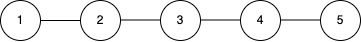

## Description

You are given an integer `c` representing `c` power stations, each with a unique identifier `id` from 1 to `c` (1‑based indexing).

These stations are interconnected via `n` **bidirectional** cables, represented by a 2D array `connections`, where each element $\text{connections}[i] = [u_{i}, v_{i}]$ indicates a connection between station $u_{i}$ and station $v_{i}$. Stations that are directly or indirectly connected form a **power grid**.

Initially, **all** stations are online (operational).

You are also given a 2D array `queries`, where each query is one of the following *two* types:

- `[1, x]`: A maintenance check is requested for station `x`. If station `x` is online, it resolves the check by itself. If station `x` is offline, the check is resolved by the operational station with the smallest `id` in the same **power grid** as `x`. If **no** **operational** station *exists* in that grid, return -1.

- `[2, x]`: Station `x` goes offline (i.e., it becomes non-operational).

Return an array of integers representing the results of each query of type `[1, x]` in the **order** they appear.

**Note:** The power grid preserves its structure; an offline (non‑operational) node remains part of its grid and taking it offline does not alter connectivity.
### Function Contract

- `n`: Input parameter.
- Returns expected result.

### Examples
#### Example 1

**Input:** c = 5, connections = [[1,2],[2,3],[3,4],[4,5]], queries = [[1,3],[2,1],[1,1],[2,2],[1,2]]

**Output:** [3,2,3]

**Explanation:**

- Initially, all stations `{1, 2, 3, 4, 5}` are online and form a single power grid.

- Query `[1,3]`: Station 3 is online, so the maintenance check is resolved by station 3.

- Query `[2,1]`: Station 1 goes offline. The remaining online stations are `{2, 3, 4, 5}`.

- Query `[1,1]`: Station 1 is offline, so the check is resolved by the operational station with the smallest `id` among `{2, 3, 4, 5}`, which is station 2.

- Query `[2,2]`: Station 2 goes offline. The remaining online stations are `{3, 4, 5}`.

- Query `[1,2]`: Station 2 is offline, so the check is resolved by the operational station with the smallest `id` among `{3, 4, 5}`, which is station 3.

#### Example 2

**Input:** c = 3, connections = [], queries = [[1,1],[2,1],[1,1]]

**Output:** [1,-1]

**Explanation:**

- There are no connections, so each station is its own isolated grid.

- Query `[1,1]`: Station 1 is online in its isolated grid, so the maintenance check is resolved by station 1.

- Query `[2,1]`: Station 1 goes offline.

- Query `[1,1]`: Station 1 is offline and there are no other stations in its grid, so the result is -1.

### Constraints

- $1 \le c \le 10^{5}$

- $0 \le n = \text{connections.length} \le min(10^{5}, c * (c - 1) / 2)$

- $\text{connections}[i].length = 2$

- $1 \le u_{i}, v_{i} \le c$

- $u_{i} \neq v_{i}$

- $1 \le \text{queries.length} \le 2 * 10^{5}$

- $\text{queries}[i].length = 2$

- $\text{queries}[i][0]$ is either 1 or 2.

- $1 \le \text{queries}[i][1] \le c$