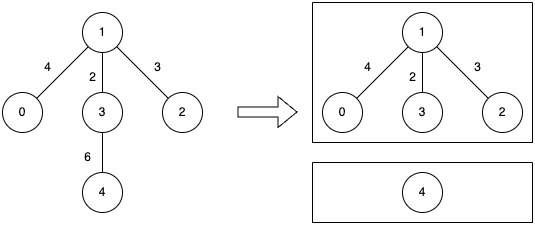
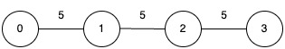

## Description

You are given an undirected connected graph with `n` nodes labeled from 0 to $n - 1$ and a 2D integer array `edges` where $\text{edges}[i] = [u_{i}, v_{i}, w_{i}]$ denotes an undirected edge between node $u_{i}$ and node $v_{i}$ with weight $w_{i}$, and an integer `k`.

You are allowed to remove any number of edges from the graph such that the resulting graph has **at most** `k` connected components.

The **cost** of a component is defined as the **maximum** edge weight in that component. If a component has no edges, its cost is 0.

Return the **minimum** possible value of the **maximum** cost among all components **after such removals**.
### Function Contract

- `n`: Input parameter.
- Returns expected result.

### Examples

#### Example 1

**Input:** n = 5, edges = [[0,1,4],[1,2,3],[1,3,2],[3,4,6]], k = 2

**Output:** 4

**Explanation:**

- Remove the edge between nodes 3 and 4 (weight 6).

- The resulting components have costs of 0 and 4, so the overall maximum cost is 4.

#### Example 2

**Input:** n = 4, edges = [[0,1,5],[1,2,5],[2,3,5]], k = 1

**Output:** 5

**Explanation:**

- No edge can be removed, since allowing only one component ($k = 1$) requires the graph to stay fully connected.

- That single component’s cost equals its largest edge weight, which is 5.

### Constraints

- $1 \le n \le 5 * 10^{4}$

- $0 \le \text{edges.length} \le 10^{5}$

- $\text{edges}[i].length = 3$

- $0 \le u_{i}, v_{i} < n$

- $1 \le w_{i} \le 10^{6}$

- $1 \le k \le n$

- The input graph is connected.