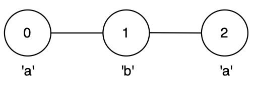
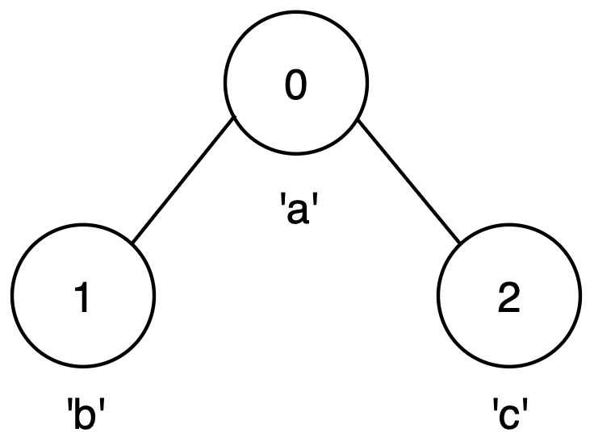
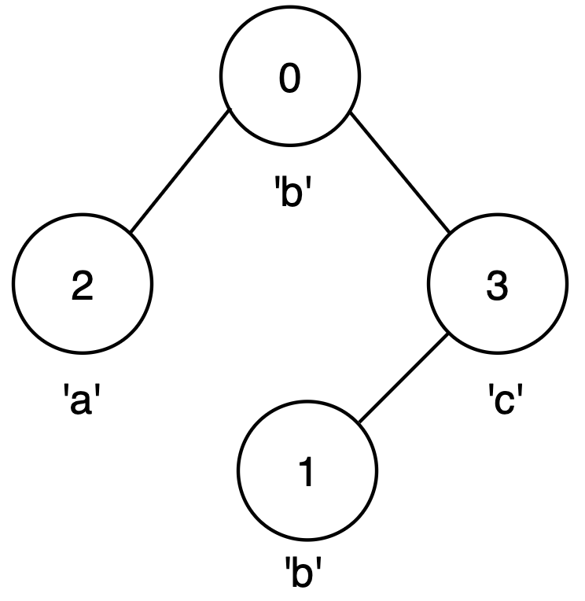

### 1. Description

You are given an integer `n` and an **undirected** graph with `n` nodes labeled from 0 to $n - 1$ and a 2D array `edges`, where $\text{edges}[i] = [u_{i}, v_{i}]$ indicates an edge between nodes $u_{i}$ and $v_{i}$.

You are also given a string `label` of length `n`, where $\text{label}[i]$ is the character associated with node `i`.

You may start at any node and move to any adjacent node, visiting each node **at most** once.

Return the **maximum** possible length of a **palindrome** that can be formed by visiting a set of **unique** nodes along a valid path.

### 2. Function Contract

**Inputs**

- `n`: Input parameter (`int`).
- `edges`: Input parameter (`List[List[int]]`).
- `label`: Input parameter (`str`).

**Return value**

- Returns `int`.

### 3. Examples

#### Example 1

- **Input:** n = 3, edges = [[0,1],[1,2]], label = "aba"

- **Output:** 3

**Exp****lanation:**

- The longest palindromic path is from node 0 to node 2 via node 1, following the path `0 → 1 → 2` forming string `"aba"`.

- This is a valid palindrome of length 3.

#### Example 2

- **Input:** n = 3, edges = [[0,1],[0,2]], label = "abc"

- **Output:** 1

- **Explanation:** 

- No path with more than one node forms a palindrome.

- The best option is any single node, giving a palindrome of length 1.

#### Example 3

- **Input:** n = 4, edges = [[0,2],[0,3],[3,1]], label = "bbac"

- **Output:** 3

- **Explanation:** 

- The longest palindromic path is from node 0 to node 1, following the path `0 → 3 → 1`, forming string `"bcb"`.

- This is a valid palindrome of length 3.

### 4. Constraints

- $1 \le n \le 14$

- $n - 1 \le \text{edges.length} \le n * (n - 1) / 2$

- $\text{edges}[i] = [u_{i}, v_{i}]$

- $0 \le u_{i}, v_{i} \le n - 1$

- $u_{i} \neq v_{i}$

- $\text{label.length} = n$

- `label` consists of lowercase English letters.

- There are no duplicate edges.
