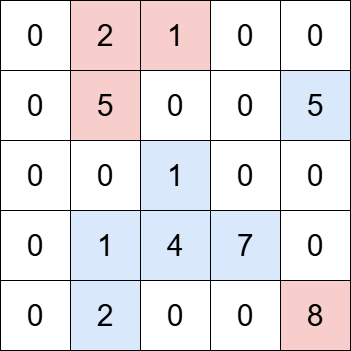
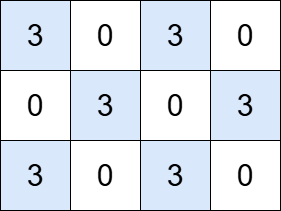

## Description

You are given an `m x n` matrix `grid` and a positive integer `k`. An **island** is a group of **positive** integers (representing land) that are **4-directionally** connected (horizontally or vertically).

The **total value** of an island is the sum of the values of all cells in the island.

Return the number of islands with a total value **divisible by** `k`.
### Function Contract

- `n`: Input parameter.
- Returns expected result.

### Examples
#### Example 1

**Input:** grid = [[0,2,1,0,0],[0,5,0,0,5],[0,0,1,0,0],[0,1,4,7,0],[0,2,0,0,8]], k = 5

**Output:** 2

**Explanation:**

The grid contains four islands. The islands highlighted in blue have a total value that is divisible by 5, while the islands highlighted in red do not.

#### Example 2

**Input:** grid = [[3,0,3,0], [0,3,0,3], [3,0,3,0]], k = 3

**Output:** 6

**Explanation:**

The grid contains six islands, each with a total value that is divisible by 3.

### Constraints

- $m = \text{grid.length}$

- $n = \text{grid}[i].length$

- $1 \le m, n \le 1000$

- $1 \le m * n \le 10^{5}$

- $0 \le \text{grid}[i][j] \le 10^{6}$

- $1 \le k \le 10^{6}$