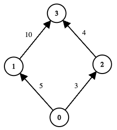
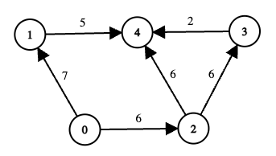

## Description

You are given a directed acyclic graph of `n` nodes numbered from 0 to `n − 1`. This is represented by a 2D array `edges` of length `m`, where $\text{edges}[i] = [u_{i}, v_{i}, \text{cost}_{i}]$ indicates a one‑way communication from node $u_{i}$ to node $v_{i}$ with a recovery cost of $\text{cost}_{i}$.

Some nodes may be offline. You are given a boolean array `online` where $\text{online}[i] = true$ means node `i` is online. Nodes 0 and `n − 1` are always online.

A path from 0 to `n − 1` is **valid** if:

- All intermediate nodes on the path are online.

- The total recovery cost of all edges on the path does not exceed `k`.

For each valid path, define its **score** as the minimum edge‑cost along that path.

Return the **maximum** path score (i.e., the largest **minimum**-edge cost) among all valid paths. If no valid path exists, return -1.
### Function Contract

- `n`: Input parameter.
- Returns expected result.

### Examples

#### Example 1

**Input:** edges = [[0,1,5],[1,3,10],[0,2,3],[2,3,4]], online = [true,true,true,true], k = 10

**Output:** 3

**Explanation:**

- The graph has two possible routes from node 0 to node 3:

		<li data-end="315" data-start="209">
		Path `0 → 1 → 3`

			<li data-end="315" data-start="234">
			Total cost = $5 + 10 = 15$, which exceeds k (`15 > 10`), so this path is invalid.

		</li>
- Path `0 → 2 → 3`

			<li data-end="397" data-start="343">
			Total cost = $3 + 4 = 7 \le k$, so this path is valid.

- The minimum edge‐cost along this path is $min(3, 4) = 3$.

		</li>

	</li>
- There are no other valid paths. Hence, the maximum among all valid path‐scores is 3.

#### Example 2

**Input:** edges = [[0,1,7],[1,4,5],[0,2,6],[2,3,6],[3,4,2],[2,4,6]], online = [true,true,true,false,true], k = 12

**Output:** 6

**Explanation:**

- Node 3 is offline, so any path passing through 3 is invalid.

- Consider the remaining routes from 0 to 4:

		<li data-end="985" data-start="840">
		Path `0 → 1 → 4`

			<li data-end="920" data-start="865">
			Total cost = $7 + 5 = 12 \le k$, so this path is valid.

- The minimum edge‐cost along this path is $min(7, 5) = 5$.

		</li>
- Path `0 → 2 → 3 → 4`

			<li data-end="1083" data-start="1017">
			Node 3 is offline, so this path is invalid regardless of cost.

		</li>
- Path `0 → 2 → 4`

			<li data-end="1166" data-start="1111">
			Total cost = $6 + 6 = 12 \le k$, so this path is valid.

- The minimum edge‐cost along this path is $min(6, 6) = 6$.

		</li>

	</li>
- Among the two valid paths, their scores are 5 and 6. Therefore, the answer is 6.

### Constraints

- $n = \text{online.length}$

- $2 \le n \le 5 * 10^{4}$

- $0 \le m = \text{edges.length} \le$min($10^{5}$, n * (n - 1) / 2)`

- $\text{edges}[i] = [u_{i}, v_{i}, \text{cost}_{i}]$

- $0 \le u_{i}, v_{i} < n$

- $u_{i} \neq v_{i}$

- $0 \le \text{cost}_{i} \le 10^{9}$

- $0 \le k \le 5 * 10^{13}$

- $\text{online}[i]$ is either `true` or `false`, and both $\text{online}[0]$ and `online[n − 1]` are `true`.

- The given graph is a directed acyclic graph.