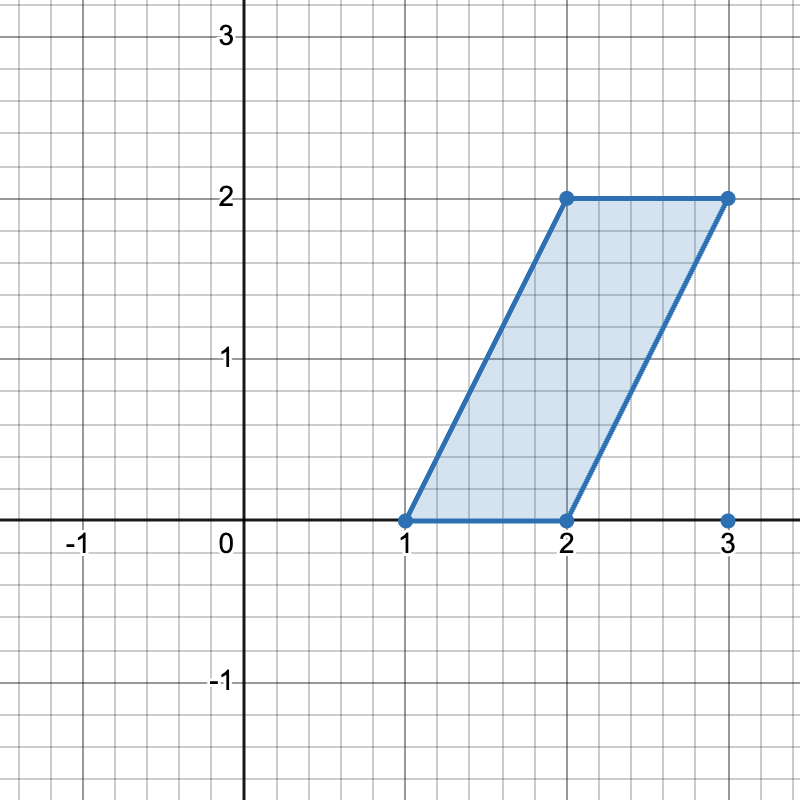
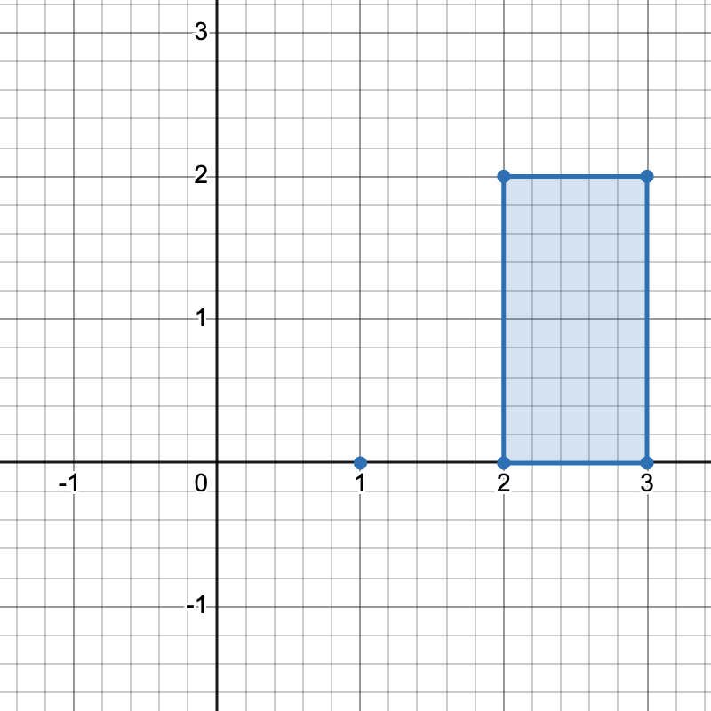
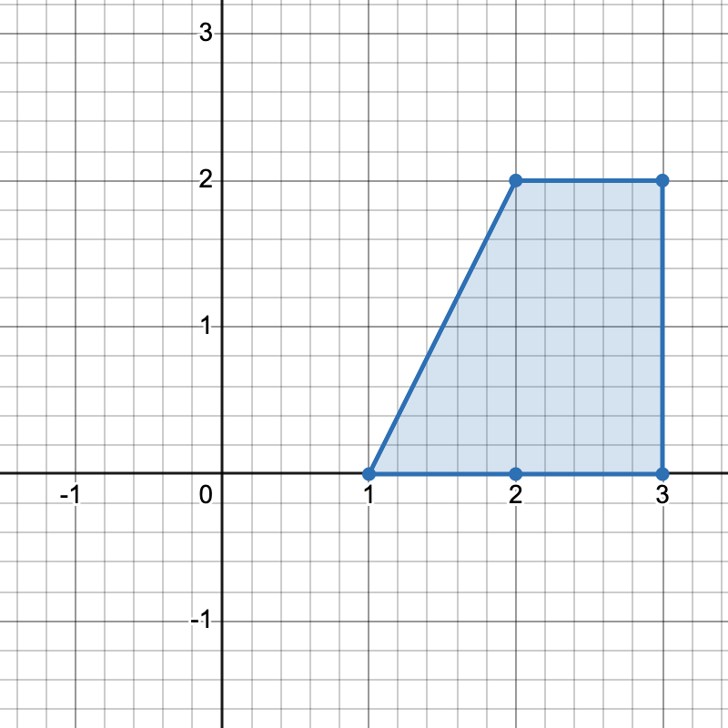
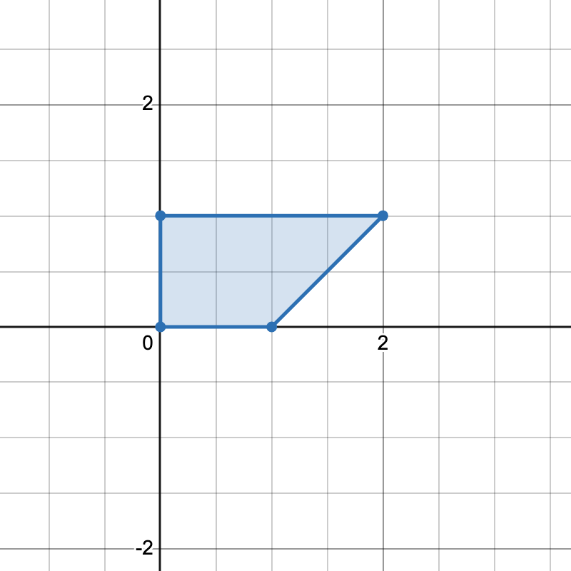

### 1. Description

You are given a 2D integer array `points`, where $\text{points}[i] = [x_{i}, y_{i}]$ represents the coordinates of the $$i^{\text{th}}$$ point on the Cartesian plane.

A **horizontal** **trapezoid** is a convex quadrilateral with **at least one pair** of horizontal sides (i.e. parallel to the x-axis). Two lines are parallel if and only if they have the same slope.

Return the * number of unique ****horizontal* *trapezoids*** that can be formed by choosing any four distinct points from `points`.

Since the answer may be very large, return it **modulo** $10^{9} + 7$.

### 2. Function Contract

**Inputs**

- `points`: Input parameter (`List[List[int]]`).

**Return value**

- Returns `int`.

### 3. Examples

#### Example 1

- **Input:** points = [[1,0],[2,0],[3,0],[2,2],[3,2]]

- **Output:** 3

- **Explanation:** 

There are three distinct ways to pick four points that form a horizontal trapezoid:

- Using points `[1,0]`, `[2,0]`, `[3,2]`, and `[2,2]`.

- Using points `[2,0]`, `[3,0]`, `[3,2]`, and `[2,2]`.

- Using points `[1,0]`, `[3,0]`, `[3,2]`, and `[2,2]`.

#### Example 2

- **Input:** points = [[0,0],[1,0],[0,1],[2,1]]

- **Output:** 1

- **Explanation:** 

There is only one horizontal trapezoid that can be formed.

### 4. Constraints

- $4 \le \text{points.length} \le 10^{5}$

- $–10^{8} \le x_{i}, y_{i} \le 10^{8}$

- All points are pairwise distinct.
