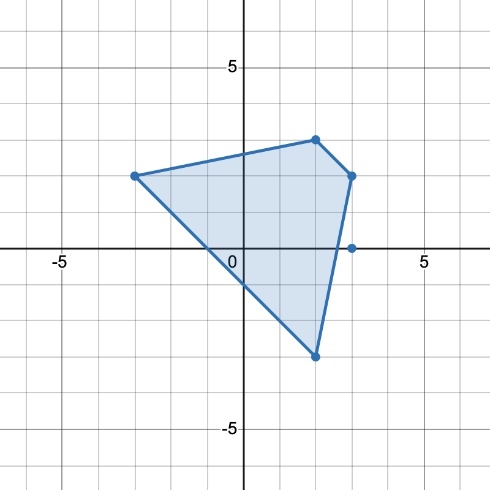
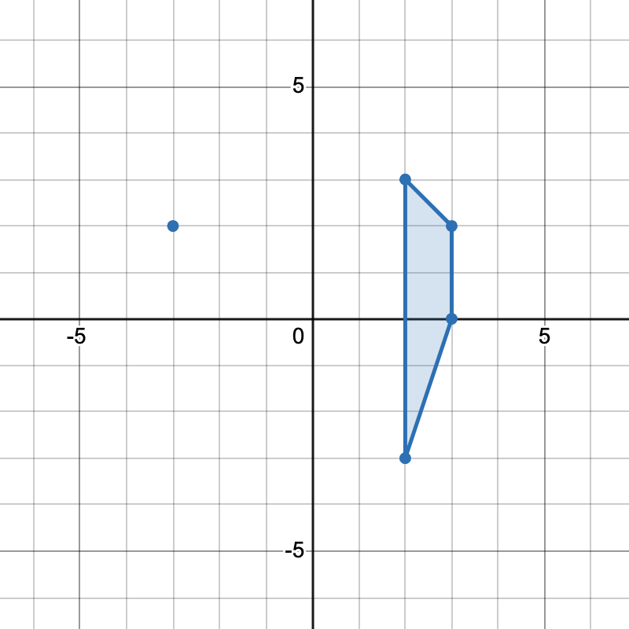

### 1. Description

You are given a 2D integer array `points` where $\text{points}[i] = [x_{i}, y_{i}]$ represents the coordinates of the $i^{\text{th}}$ point on the Cartesian plane.

Return *the number of unique **trapezoids* that can be formed by choosing any four distinct points from `points`.

A** ****trapezoid** is a convex quadrilateral with **at least one pair** of parallel sides. Two lines are parallel if and only if they have the same slope.

### 2. Function Contract

**Inputs**

- `points`: Input parameter (`List[List[int]]`).

**Return value**

- Returns `int`.

### 3. Examples

#### Example 1

- **Input:** points = [[-3,2],[3,0],[2,3],[3,2],[2,-3]]

- **Output:** 2

- **Explanation:** 

There are two distinct ways to pick four points that form a trapezoid:

- The points `[-3,2], [2,3], [3,2], [2,-3]` form one trapezoid.

- The points `[2,3], [3,2], [3,0], [2,-3]` form another trapezoid.

#### Example 2

- **Input:** points = [[0,0],[1,0],[0,1],[2,1]]

- **Output:** 1

- **Explanation:** 

There is only one trapezoid which can be formed.

### 4. Constraints

- $4 \le \text{points.length} \le 500$

- $–1000 \le x_{i}, y_{i} \le 1000$

- All points are pairwise distinct.
