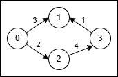

### 1. Description

You are given a directed, weighted graph with `n` nodes labeled from 0 to $n - 1$, and an array `edges` where $\text{edges}[i] = [u_{i}, v_{i}, w_{i}]$ represents a directed edge from node $u_{i}$ to node $v_{i}$ with cost $w_{i}$.

Each node $u_{i}$ has a switch that can be used **at most once**: when you arrive at $u_{i}$ and have not yet used its switch, you may activate it on one of its incoming edges $v_{i} → u_{i}$ reverse that edge to $u_{i} → v_{i}$ and **immediately** traverse it.

The reversal is only valid for that single move, and using a reversed edge costs $2 * w_{i}$.

Return the **minimum** total cost to travel from node 0 to node $n - 1$. If it is not possible, return -1.

### 2. Function Contract

**Inputs**

- `n`: Input parameter (`int`).
- `edges`: Input parameter (`List[List[int]]`).

**Return value**

- Returns `int`.

### 3. Examples

#### Example 1

- **Input:** n = 4, edges = [[0,1,3],[3,1,1],[2,3,4],[0,2,2]]

- **Output:** 5

- **Explanation:** 

**

**

- Use the path `0 → 1` (cost 3).

- At node 1 reverse the original edge `3 → 1` into `1 → 3` and traverse it at cost $2 * 1 = 2$.

- Total cost is $3 + 2 = 5$.

#### Example 2

- **Input:** n = 4, edges = [[0,2,1],[2,1,1],[1,3,1],[2,3,3]]

- **Output:** 3

- **Explanation:** 

- No reversal is needed. Take the path `0 → 2` (cost 1), then `2 → 1` (cost 1), then `1 → 3` (cost 1).

- Total cost is $1 + 1 + 1 = 3$.

### 4. Constraints

- $2 \le n \le 5 * 10^{4}$

- $1 \le \text{edges.length} \le 10^{5}$

- $\text{edges}[i] = [u_{i}, v_{i}, w_{i}]$

- $0 \le u_{i}, v_{i} \le n - 1$

- $1 \le w_{i} \le 1000$
