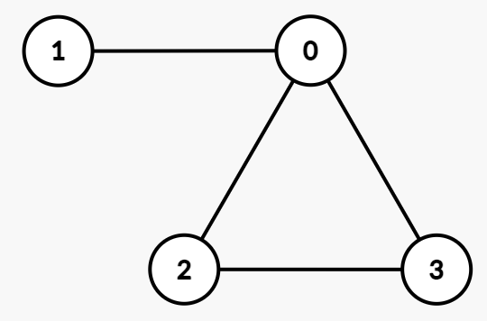

### 1. Description

You are given an integer array `degrees`, where $\text{degrees}[i]$ represents the desired degree of the $i^{\text{th}}$ vertex.

Your task is to determine if there exists an **undirected simple** graph with **exactly** these vertex degrees.

A **simple** graph has no self-loops or parallel edges between the same pair of vertices.

Return `true` if such a graph exists, otherwise return `false`.

### 2. Function Contract

- Refer to method signature.

### 3. Examples

#### Example 1

- **Input:** degrees = [3,1,2,2]

- **Output:** true

- **Explanation:** 

One possible undirected simple graph is:

- Edges: `(0, 1), (0, 2), (0, 3), (2, 3)`

- Degrees: $deg(0) = 3$, $deg(1) = 1$, $deg(2) = 2$, $deg(3) = 2$.

#### Example 2

- **Input:** degrees = [1,3,3,1]

- **Output:** false

- **Explanation:** 

- $\text{degrees}[1] = 3$ and $\text{degrees}[2] = 3$ means they must be connected to all other vertices.

- This requires $\text{degrees}[0]$ and $\text{degrees}[3]$ to be at least 2, but both are equal to 1, which contradicts the requirement.

- Thus, the answer is `false`.

### 4. Constraints

- $1 \le n = \text{degrees.length} \le 10^5$

- $0 \le \text{degrees}[i] \le n - 1$
