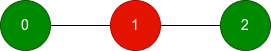
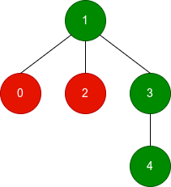

### 1. Description

You are given an **undirected tree** with `n` nodes, numbered from 0 to $n - 1$. It is represented by a 2D integer array `edges`​​​​​​​ of length $n - 1$, where $\text{edges}[i] = [a_{i}, b_{i}]$ indicates that there is an edge between nodes $a_{i}$ and $b_{i}$ in the tree.

You are also given an integer array `good` of length `n`, where $\text{good}[i]$ is 1 if the $$i^{\text{th}}$$ node is good, and 0 if it is bad.

Define the **score** of a **subgraph** as the number of good nodes minus the number of bad nodes in that subgraph.

For each node `i`, find the **maximum** possible score among all **connected subgraphs** that contain node `i`.

Return an array of `n` integers where the $$i^{\text{th}}$$ element is the **maximum** score for node `i`.

A **subgraph** is a graph whose vertices and edges are subsets of the original graph.

A **connected subgraph** is a subgraph in which every pair of its vertices is reachable from one another using only its edges.

### 2. Function Contract

**Inputs**

- `n`: The number of nodes, labeled from `0` through $n - 1$.
- `edges`: The undirected edges of a valid tree.
- `good`: A binary classification for each node, where `1` means good and `0` means bad.

Assign weight $+1$ to every good node and $-1$ to every bad node. The score of a selected connected subgraph is the sum of its node weights.

**Return value**

Return `answer`, where $\text{answer}[i]$ is the maximum weight sum of any connected subgraph containing node `i`. Different nodes may attain their maxima with different subgraphs, and the maximizing subgraph need not be unique.

### 3. Examples

#### Example 1

**Input:** n = 3, edges = [[0,1],[1,2]], good = [1,0,1]

**Output:** [1,1,1]

**Explanation:**

- Green nodes are good and red nodes are bad.

- For each node, the best connected subgraph containing it is the whole tree, which has 2 good nodes and 1 bad node, resulting in a score of 1.

- Other connected subgraphs containing a node may have the same score.

#### Example 2

**Input:** n = 5, edges = [[1,0],[1,2],[1,3],[3,4]], good = [0,1,0,1,1]

**Output:** [2,3,2,3,3]

**Explanation:**

- Node 0: The best connected subgraph consists of nodes `0, 1, 3, 4`, which has 3 good nodes and 1 bad node, resulting in a score of $3 - 1 = 2$.

- Nodes 1, 3, and 4: The best connected subgraph consists of nodes `1, 3, 4`, which has 3 good nodes, resulting in a score of 3.

- Node 2: The best connected subgraph consists of nodes `1, 2, 3, 4`, which has 3 good nodes and 1 bad node, resulting in a score of $3 - 1 = 2$.

#### Example 3

**Input:** n = 2, edges = [[0,1]], good = [0,0]

**Output:** [-1,-1]

**Explanation:**

For each node, including the other node only adds another bad node, so the best score for both nodes is -1.

### 4. Constraints

- $2 \le n \le 10^{5}$

- $\text{edges.length} = n - 1$

- $\text{edges}[i] = [a_{i}, b_{i}]$

- $0 \le a_{i}, b_{i} < n$

- $\text{good.length} = n$

- $0 \le \text{good}[i] \le 1$

- The input is generated such that `edges` represents a valid tree.