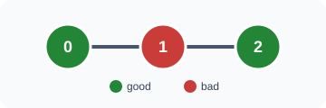
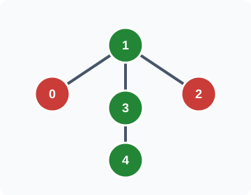

## Examples

**Example 1**

- Input: `n = 3, edges = [[0,1],[1,2]], good = [1,0,1]`
- Output: `[1,1,1]`
- Explanation: Green nodes in the diagram are good and red nodes are bad. For every node, the entire tree is an optimal connected subgraph containing it: two good nodes minus one bad node gives score `1`. Other connected subgraphs containing a particular node can tie this score.

**Example 2**

- Input: `n = 5, edges = [[1,0],[1,2],[1,3],[3,4]], good = [0,1,0,1,1]`
- Output: `[2,3,2,3,3]`
- Explanation:
  - For node 0, choose nodes `0,1,3,4`. They contain three good nodes and one bad node, so the score is `3 - 1 = 2`.
  - For nodes 1, 3, and 4, choose nodes `1,3,4`. All three are good, producing score `3`.
  - For node 2, choose nodes `1,2,3,4`. Three are good and one is bad, producing `3 - 1 = 2`.

**Example 3**

- Input: `n = 2, edges = [[0,1]], good = [0,0]`
- Output: `[-1,-1]`
- Explanation: For either required node, adding the other node contributes one more bad node. Selecting only the required node therefore gives the best score, `-1`.
