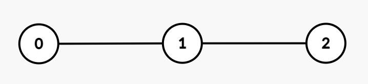
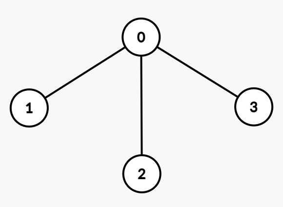

### 1. Description

You are given an integer `n` and an undirected tree with `n` nodes numbered from 0 to $n - 1$. This is represented by a 2D array `edges` of length $n - 1$, where $\text{edges}[i] = [u_{i}, v_{i}]$ indicates an undirected edge between nodes $u_{i}$ and $v_{i}$.

You are also given an integer array `group` of length `n`, where $\text{group}[i]$ denotes the group label assigned to node `i`.

- Two nodes `u` and `v` are considered part of the same group if $\text{group}[u] = \text{group}[v]$.

- The **interaction cost** between `u` and `v` is defined as the number of edges on the unique path connecting them in the tree.

Return an integer denoting the **sum** of interaction costs over all **unordered** pairs `(u, v)` with $u \neq v$ such that $\text{group}[u] = \text{group}[v]$.

### 2. Function Contract

**Inputs**

- `n`: The number of nodes in the tree.
- `edges`: The $n - 1$ undirected edges, each represented as `[u, v]`.
- `group`: The group label assigned to each node.

Every two nodes have exactly one path because `edges` forms a valid tree. Each unordered pair is counted once, and a node is never paired with itself.

**Return value**

Return the sum of path lengths over all unordered pairs `(u, v)` with $u \neq v$ and $\text{group}[u] = \text{group}[v]$.

### 3. Examples

#### Example 1

- **Input:** n = 3, edges = [[0,1],[1,2]], group = [1,1,1]

- **Output:** 4

- **Explanation:** 

**

**

All nodes belong to group 1. The interaction costs between the pairs of nodes are:

- Nodes `(0, 1)`: 1

- Nodes `(1, 2)`: 1

- Nodes `(0, 2)`: 2

Thus, the total interaction cost is $1 + 1 + 2 = 4$.

#### Example 2

- **Input:** n = 3, edges = [[0,1],[1,2]], group = [3,2,3]

- **Output:** 2

- **Explanation:** 

- Nodes 0 and 2 belong to group 3. The interaction cost between this pair is 2.

- Node 1 belongs to a different group and forms no valid pair. Therefore, the total interaction cost is 2.

#### Example 3

- **Input:** n = 4, edges = [[0,1],[0,2],[0,3]], group = [1,1,4,4]

- **Output:** 3

- **Explanation:** 

Nodes belonging to the same groups and their interaction costs are:

- Group 1: Nodes `(0, 1)`: 1

- Group 4: Nodes `(2, 3)`: 2

Thus, the total interaction cost is $1 + 2 = 3$.

#### Example 4

- **Input:** n = 2, edges = [[0,1]], group = [9,8]

- **Output:** 0

- **Explanation:** All nodes belong to different groups and there are no valid pairs. Therefore, the total interaction cost is 0.

### 4. Constraints

- $1 \le n \le 10^{5}$

- $\text{edges.length} = n - 1$

- $\text{edges}[i] = [u_{i}, v_{i}]$

- $0 \le u_{i}, v_{i} \le n - 1$

- $\text{group.length} = n$

- $1 \le \text{group}[i] \le 20$

- The input is generated such that `edges` represents a valid tree.
