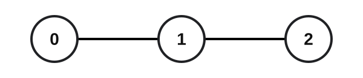
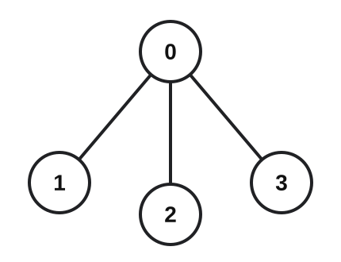

## Examples

**Example 1**

- Input: `n = 3, edges = [[0,1],[1,2]], group = [1,1,1]`
- Output: `4`

- Explanation:
  - All three nodes have group label `1`.
  - Pair `(0, 1)` has interaction cost `1`.
  - Pair `(1, 2)` has interaction cost `1`.
  - Pair `(0, 2)` has interaction cost `2`.
  - Their total is `1 + 1 + 2 = 4`.

**Example 2**

- Input: `n = 3, edges = [[0,1],[1,2]], group = [3,2,3]`
- Output: `2`
- Explanation:
  - Nodes `0` and `2` share group label `3`, and the path between them uses two edges, so their cost is `2`.
  - Node `1` has a different label and forms no valid pair. The total is therefore `2`.

**Example 3**

- Input: `n = 4, edges = [[0,1],[0,2],[0,3]], group = [1,1,4,4]`
- Output: `3`

- Explanation:
  - In group `1`, pair `(0, 1)` has interaction cost `1`.
  - In group `4`, pair `(2, 3)` has interaction cost `2` because its path passes through node `0`.
  - The total is `1 + 2 = 3`.

**Example 4**

- Input: `n = 2, edges = [[0,1]], group = [9,8]`
- Output: `0`
- Explanation:
  - The two nodes have different group labels, so there is no valid pair and the total interaction cost is `0`.
