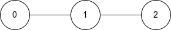
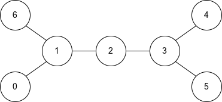
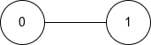

### 1. Description

You are given an **undirected tree** with `n` nodes, numbered from 0 to $n - 1$. It is represented by a 2D integer array `edges` of length $n - 1$, where $\text{edges}[i] = [a_{i}, b_{i}]$ indicates that there is an edge between nodes $a_{i}$ and $b_{i}$ in the tree.

A node is called **special** if it is an **endpoint** of any** diameter path** of the tree.

Return a binary string `s` of length `n`, where $s[i] = '1'$ if node `i` is special, and $s[i] = '0'$ otherwise.

A **diameter path** of a tree is the **longest** simple path between any two nodes. A tree may have multiple diameter paths.

An **endpoint** of a path is the **first** or **last** node on that path.

### 2. Function Contract

**Inputs**

- `n`: The number of tree nodes.
- `edges`: The $n - 1$ undirected edges, each written as `[a, b]`.

The first and last nodes of a path are its endpoints. A node qualifies if it is an endpoint of any maximum-length simple path, not merely one selected diameter.

**Return value**

Return an `n`-character binary string whose index `i` is `'1'` exactly when node `i` is an endpoint of at least one diameter path.

### 3. Examples

#### Example 1

**

**

- **Input:** n = 3, edges = [[0,1],[1,2]]

- **Output:** "101"

- **Explanation:** 

- The diameter of this tree consists of 2 edges.

- The only diameter path is the path from node 0 to node 2

- The endpoints of this path are nodes 0 and 2, so they are special.

#### Example 2

**

**

- **Input:** n = 7, edges = [[0,1],[1,2],[2,3],[3,4],[3,5],[1,6]]

- **Output:** "1000111"

- **Explanation:** The diameter of this tree consists of 4 edges. There are 4 diameter paths:

- The path from node 0 to node 4

- The path from node 0 to node 5

- The path from node 6 to node 4

- The path from node 6 to node 5

The special nodes are nodes `0, 4, 5, 6`, as they are endpoints in at least one diameter path.

#### Example 3

**

**

- **Input:** n = 2, edges = [[0,1]]

- **Output:** "11"

- **Explanation:** 

- The diameter of this tree consists of 1 edge.

- The only diameter path is the path from node 0 to node 1

- The endpoints of this path are nodes 0 and 1, so they are special.

### 4. Constraints

- $2 \le n \le 10^{5}$

- $\text{edges.length} = n - 1$

- $\text{edges}[i] = [a_{i}, b_{i}]$

- $0 \le a_{i}, b_{i} < n$

- The input is generated such that `edges` represents a valid tree.
