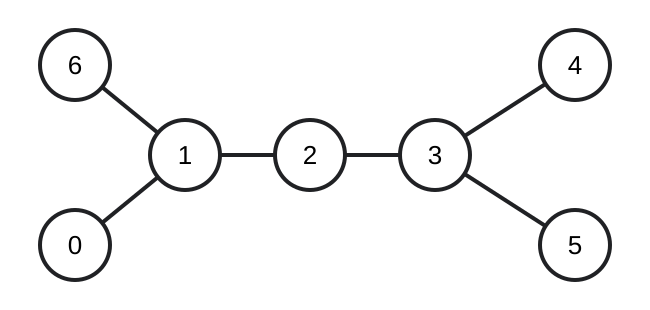
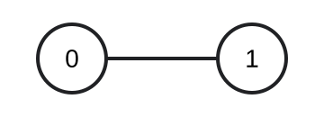

## Examples

**Example 1**

- Input: `n = 3, edges = [[0,1],[1,2]]`
- Output: `"101"`

- Explanation:
  - The tree diameter has `2` edges.
  - Its only diameter path runs from node `0` to node `2`.
  - Nodes `0` and `2` are its endpoints, so those two nodes are special.

**Example 2**

- Input: `n = 7, edges = [[0,1],[1,2],[2,3],[3,4],[3,5],[1,6]]`
- Output: `"1000111"`

- Explanation:
  - The diameter has `4` edges, and four paths attain that length:
    - node `0` to node `4`;
    - node `0` to node `5`;
    - node `6` to node `4`;
    - node `6` to node `5`.
  - Consequently, nodes `0`, `4`, `5`, and `6` are endpoints of at least one diameter path and are special.

**Example 3**

- Input: `n = 2, edges = [[0,1]]`
- Output: `"11"`

- Explanation:
  - The diameter contains `1` edge, and its only path runs from node `0` to node `1`.
  - Both nodes are endpoints, so both are special.
