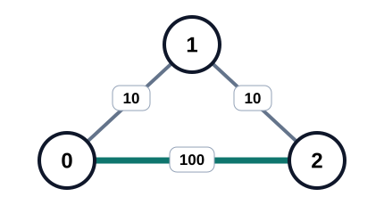
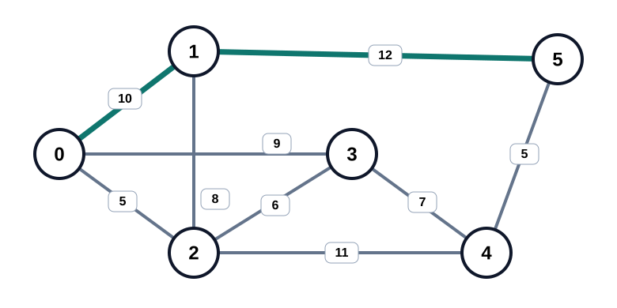
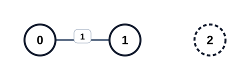

## Examples

**Example 1**

- Input: `n = 3, edges = [[0,1,10],[1,2,10],[0,2,100]], k = 1`
- Output: `100`
- Explanation:
  - With at most one edge, the only possible route is the direct edge `0 -> 2`.
  - That edge costs `100` to repair, so the minimum required value of `money` is `100`.

**Example 2**

- Input: `n = 6, edges = [[0,2,5],[2,3,6],[3,4,7],[4,5,5],[0,1,10],[1,5,12],[0,3,9],[1,2,8],[2,4,11]], k = 2`
- Output: `12`
- Explanation:
  - Setting `money = 12` repairs every listed edge because each cost is at most `12`.
  - The route `0 -> 1 -> 5` then reaches node `5` using exactly two edges.
  - For every `money < 12`, no route from node `0` to node `5` uses at most `k = 2` repaired edges.
  - Therefore the minimum required amount is `12`.

**Example 3**

- Input: `n = 3, edges = [[0,1,1]], k = 1`
- Output: `-1`
- Explanation:
  - Node `2` is disconnected from node `0`, even when the only edge is repaired.
  - No amount of money can reach the destination, so the answer is `-1`.
